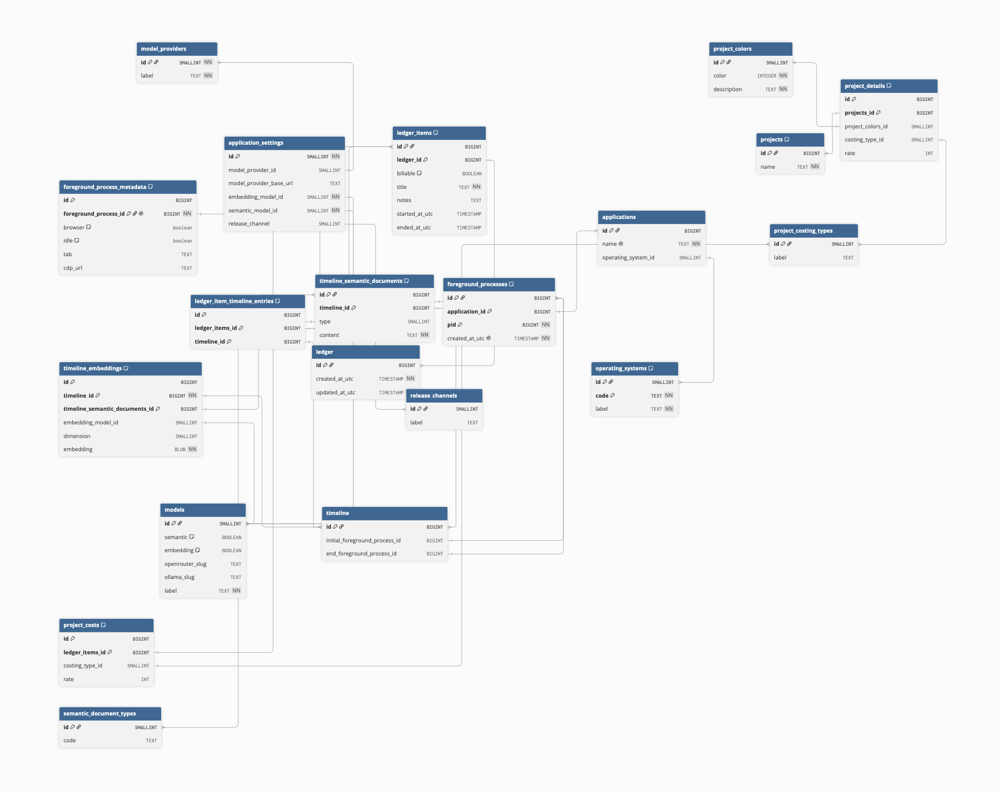

# Considerations

- We're not storing a new entry in foreground_process every poll, DB will grow very quickly if we do
- Calculating the timeline:
   - `initial_foreground_process_id` && `end_foreground_process_id` NOT NULL: foreground application has changed
   - `initial_foreground_process_id` && `end_foreground_process_id` NULL: current foreground application
   - duration: `end_foreground_process.created_at_utc` - `initial_foreground_process.created_at_utc`
   - idle if: `foreground_process.foreground_process_metadata.idle`
- Timeline semantic documents:
   - Current renderers are [here](../../../sidecar/semantic/documents.go)
   - RAG search:
      - We use vector search to find relevant documents, `timeline_semantic_documents.content` is what gets cited
- Add support for different costing structures: hourly / deliverable
   - Ledger items are costing independent, they just specify if the time is billable
   - Hourly: set rate on the project, deliverable: set rate on project costs. If both, deliverable takes precendence
   - A project is built up of one to many ledger items. Sum it up to get total cost

Previous tables vs. New tables:
| Previous Table | New Table |
| --- | --- |
| transition_events | foreground_processes |
| transition_event_metadata | foreground_process_metadata |
| transition_event_reasons | NONE |
| applications | applications |
| semantic_documents | timeline_semantic_documents |
| semantic_document_embeddings | timeline_embeddings |
| embedding_models | models |
| semantic_models | models |
| ai_settings | application_settings |
| projects | projects |
| timesheets | ledger |
| timesheet_entries | ledger_items |
| timesheet_entry_usage_blocks | ledger_item_timeline_entries |

DBML:

```
// Event store
Table foreground_processes {
  id BIGINT // auto increment
  application_id BIGINT [ref: < applications.id]
  pid BIGINT [NOT NULL]
  created_at_utc TIMESTAMP [NOT NULL, UNIQUE]

  indexes {
    (id, application_id, pid) [PK]
    created_at_utc [UNIQUE]
  }
}

TABLE foreground_process_metadata {
  id BIGINT // auto increment
  foreground_process_id BIGINT [ref: - foreground_processes.id, UNIQUE, NOT NULL]
  browser boolean [default: FALSE]
  idle boolean [default: FALSE]
  tab TEXT
  cdp_url TEXT // chrome dev tools protocol

  indexes {
    (id, foreground_process_id) [PK]
  }
}

// Timeline
TABLE timeline {
  id BIGINT [PRIMARY KEY] // auto increment
  initial_foreground_process_id BIGINT [ref: < foreground_processes.id]
  end_foreground_process_id BIGINT [ref: < foreground_processes.id]
}

TABLE timeline_semantic_documents {
  id BIGINT // auto increment
  timeline_id BIGINT [ref: < timeline.id]
  type SMALLINT [ref: < semantic_document_types.id]
  content TEXT [NOT NULL]

  indexes {
    (id, timeline_id) [PK]
  }
}

TABLE timeline_embeddings {
  id BIGINT [PRIMARY KEY] // auto increment
  timeline_id BIGINT [ref: < timeline.id, NOT NULL]
  timeline_semantic_documents_id BIGINT [ref: < timeline_semantic_documents.id]
  embedding_model_id SMALLINT [ref: < models.id]
  dimension SMALLINT
  embedding BLOB [NOT NULL]

  indexes {
    (id, timeline_id, timeline_semantic_documents_id) [PK]
  }
}

// Entries
TABLE ledger {
  id BIGINT [PRIMARY KEY] // auto increment
  created_at_utc TIMESTAMP [NOT NULL]
  updated_at_utc TIMESTAMP [NOT NULL]
}

TABLE ledger_items {
  id BIGINT // auto increment
  ledger_id BIGINT [ref: < ledger.id]
  billable BOOLEAN [default: FALSE]
  title TEXT [NOT NULL]
  notes TEXT
  started_at_utc TIMESTAMP
  ended_at_utc TIMESTAMP

  indexes {
    (id, ledger_id) [PK]
  }
}

TABLE ledger_item_timeline_entries {
  id BIGINT // auto increment
  ledger_items_id BIGINT [ref: < ledger_items.id]
  timeline_id BIGINT [ref: < timeline.id]

  indexes {
    (id, ledger_items_id, timeline_id) [PK]
  }
}

TABLE projects {
  id BIGINT [PRIMARY KEY] // auto increment
  name TEXT [NOT NULL]

  indexes {
    `name COLLATE NOCASE` [UNIQUE]
  }
}

TABLE project_costs {
  id BIGINT // auto increment
  ledger_items_id BIGINT [ref: < ledger_items.id]
  costing_type_id SMALLINT [ref: < project_costing_types.id]
  rate INT

  indexes {
    (id, ledger_items_id) [PK]
  }
}

TABLE project_details {
  id BIGINT // auto increment
  projects_id BIGINT [ref: < projects.id]
  project_colors_id SMALLINT [ref: < project_colors.id]
  costing_type_id SMALLINT [ref: < project_costing_types.id]
  rate INT

  indexes {
    (id, projects_id) [PK]
  }
}

// App settings
TABLE application_settings {
  id SMALLINT [PRIMARY KEY, NOT NULL] // auto increment
  model_provider_id SMALLINT [ref: < model_providers.id]
  model_provider_base_url TEXT
  embedding_model_id SMALLINT [ref: < models.id, NOT NULL]
  semantic_model_id SMALLINT [ref: < models.id, NOT NULL]
  release_channel SMALLINT [ref: < release_channels.id] // knowing the release channel helps with feature toggles if we ever do introduce them
}

// Reference data
Table applications {
  id BIGINT [PRIMARY KEY] // auto increment
  name TEXT [NOT NULL, UNIQUE]
  operating_system_id SMALLINT [ref: < operating_systems.id]
}

Table operating_systems {
  id SMALLINT // auto increment
  code TEXT [NOT NULL]
  label TEXT [NOT NULL]

  indexes {
    (id, code) [PK]
  }
}

TABLE project_colors {
  id SMALLINT [PRIMARY KEY] // auto increment
  color INTEGER [NOT NULL]
  description TEXT [NOT NULL]
}

TABLE project_costing_types {
  id SMALLINT [PRIMARY KEY] // auto increment
  label TEXT
}

TABLE model_providers {
  id SMALLINT [PRIMARY KEY, NOT NULL] // auto increment
  label TEXT [NOT NULL]
}

TABLE models {
  id SMALLINT [PRIMARY KEY] // auto increment
  semantic BOOLEAN [default: FALSE]
  embedding BOOLEAN [default: FALSE]
  openrouter_slug TEXT
  ollama_slug TEXT
  label TEXT [NOT NULL]
}

TABLE release_channels {
  id SMALLINT [PRIMARY KEY] // auto increment
  label TEXT
}

TABLE semantic_document_types {
  id SMALLINT [PRIMARY KEY] // auto increment
  code TEXT
}
```


