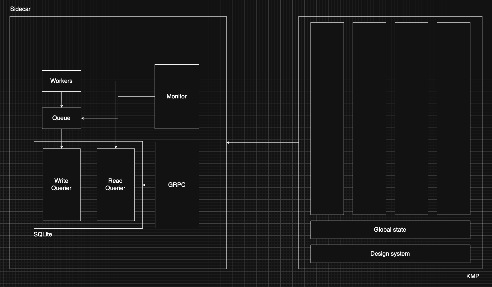

# Overview

The current implementation suffers from one big problem: frequent errors caused by concurrent writes. This is mainly due to the usage monitor which writes to the database as a callback. SQLite does not support concurrent writes and any attempt to write concurrently will result in `SQLITE_BUSY` (database is locked) errors. This can be worked around by setting the number of max connections allowed to 1, this forces operations to queue up and execute serially. However, this isn't ideal too as it sometimes causes SQLite to throw a busy timeout which while it can be tweaked as a workaround is more appropriately solved by redesigning the architecture. The current implementation evolved out of a rare concurrent writes implementation.

# Design goals

The solution is to separate reads from writes from the lowest level up. This form of architecture is also known as *Command Query Responsibility Segregation (CQRS)*. *Query* **reads**, *Command* **writes**.

We want to:
- Eliminate SQLite infrastructure errors (db locked and timeouts)

- Separate queries which read and queries which write from the same interface since the two operations have very different performance characteristics

- Easily add on background workers. At the moment we rely on background workers to store embeddings but there is a possible case for adding on more workers to make sense of a users usage history locally

# Ideal state

Basically it looks like this: 

# Approach

Database:
- `Querier` -> `ReadQuerier` + `WriteQuerier`
   - Solves: `SQLITE_BUSY`, separates operations
- `sync.Mutex` + `WriteQuerier` = `SerialWriteQuerier`
   - Solves: SQLite timeouts
   - We want to minimize connection string tweaking. If we can acquire a lock before writing, we are unlikely to have SQLite throw. This also allows us to not have to restrict the number of open connections

- Monitor:
   - Polls for the current foreground process and enqueues it
   - It only writes

Workers:
- Events: `ForegroundProcessPolled`, `TimelineUpserted`, `TimelineIndexed`
   - `ForegroundProecessPolled`: More on this later but right now we only report when we transition away from the foreground application. The result is that we can't show what the foreground application is. We want to move towards just polling what the foreground process is and building a timeline from that
   - `TimelineUpserted`: We have a sequence of foreground proess polled events and we want to construct a linear timeline from it. How we build the timeline up will depend on it's granularity, within the same unit, only the latest foreground process should be shown UI side. This would allow us to query a datetime range and get a nice sequence of foreground applications without having to normalize client side
   - `TimelineIndexed`: Once normalized, we want to be able to query the timeline
- Write heavy
- Runs async

GRPC:
- Mostly read heavy
- Runs sync
- The occasional sync write to store settings and user data will have to acquire a lock first
