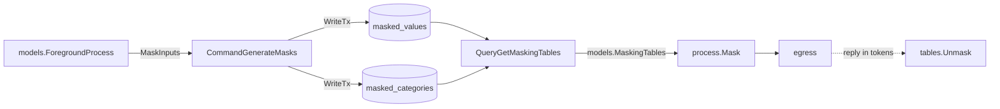

# `masking` — reversible pseudonymisation of foreground processes

The `masking` component owns the two tables behind
[`models.ForegroundProcess.Mask`](../timeline/models/mask.go): the token dictionary and the category
permutation. `Mask` itself lives with the domain type in
[`timeline/models`](../timeline/README.md) and is pure — this component is what fills the tables it
reads and what turns a token back into the thing it stands for.

The problem it exists for: a foreground process carries window titles, browser tabs and CDP URLs,
coordinates, the public IP, and app paths that embed the OS username. Anywhere one of those leaves
the machine — a third-party model, an export, a support bundle — it should leave as something that
still supports *"the same app as before"* without saying **which** app.

## Package map

| Symbol | Path | Role |
| --- | --- | --- |
| `CommandGenerateMasks` | [`generate_masks.go`](generate_masks.go) | Issue a token per value, complete the category permutation |
| `QueryGetMaskingTables` | [`get_masking_tables.go`](get_masking_tables.go) | Read both tables whole into a `models.MaskingTables` |
| `enumsmaskingcategory.MaskingCategory` | [`../../enums/enums_masking_category/`](../../enums/enums_masking_category/masking_category.go) | Which kind of field a value came from — the scope of a token |
| `models.MaskingTables` / `.Mask` / `.Unmask` | [`../timeline/models/mask.go`](../timeline/models/mask.go) | The transform and its inverse |

## Two treatments

Fields split by whether hiding the value costs anything a consumer needed:

- **Tokenised** — `AppName`, `AppIdentifier`, `AppMetadata.FriendlyName`, `Browser.Vendor`,
  `Browser.AppIdentifier`, `Browser.Domain`. Each becomes a stable random token
  (`app_name_<32 hex chars>`), so equality across samples survives and the value does not.
- **Blanked** — `AppPath`, `PID`, `WindowTitle`, `AppMetadata.IconPath`, `Browser.Tab`,
  `Browser.CdpURL`, and all of `Location`. Nothing correlates on these that the tokenised fields do
  not already carry.
- **Permuted** — `AppMetadata.Category` and `Browser.Category` stand in for a different member of the
  seeded taxonomy.

`AppMetadata.Description`, `.Source`, `TitleSource`, `Timestamp`, `Idle` and `Killed` pass through:
they are catalog or timing facts, not user data.

## Flow



Generation writes and reading does not, so they are two operations rather than one:

```go
generate := masking.CommandGenerateMasks{Processes: page}
if err := generate.Exec(ctx, svcs); err != nil {
    return err
}

query := masking.QueryGetMaskingTables{}
tables, err := query.Exec(ctx, svcs)
```

`MaskInputs` is what makes that first step possible without the caller knowing the field map, and it
sits directly beside `Mask` so the two cannot drift.

## Invariants

- **Masking fails closed.** A value the tables have no token for masks to `models.MaskedPlaceholder`,
  never to itself. With assertions on it panics instead — reaching that branch means the caller
  skipped generation.
- **Presence survives, value does not.** A nil optional stays nil and a non-nil one keeps a value, so
  a masked idle sample still satisfies `IsIdle` and a masked ordinary application does not become a
  browser. That second one is why an empty string passes through untouched rather than being
  tokenised.
- **The category mapping is a permutation, not a mapping.** Both uniques on `masked_categories` are
  load-bearing: without `unique_masked_category_target` two categories could collapse onto one
  stand-in and unmasking would stop being a function. `CategoryUnknown` is held out of it and maps to
  itself.
- **Tokens are stable for the life of the install.** That is the entire reason they are persisted
  rather than derived per call.

> **Note:** the permutation makes `Category.IsProductive()` and `Category.Label()` report the
> stand-in's answer. Never compute a focus score, a productivity split or a label off masked data.

> **Note:** `Mask` is an egress transform and nothing else. It zeroes `PID` and `WindowTitle`, which
> are the two fields `ForegroundProcess.IsEqual` compares, so every masked non-idle sample compares
> equal — masked processes must never reach `CollectTimeline` or anything else that folds on that
> key.

## Known gaps

> **No production caller.** `Mask` is tested but unwired. Deciding when masking applies — always for
> [`semantic`](../../semantic/)'s OpenRouter path, on request for an export, never for local
> [`ollama`](../../semantic/ollama.go) — is a separate change.

> **`Browser.Domain` has no column and `Browser.AppIdentifier` is never populated**, per the
> [timeline README](../timeline/README.md)'s "Read but never written". Masking them is written for
> the intended behaviour; on DB-sourced entries today only the tests reach those branches.

> **`QueryGetMaskingTables` reads both tables whole.** `masked_values` grows with distinct browser
> domains, which is unbounded over a long-lived install. Fine at present scale; the fix when it is
> not is to filter to the values in the batch rather than to page the read.

> **Generation is idempotent but not atomic against a concurrent run.** Both writes take the serial
> write lock, and `InsertMaskedCategory` is `ON CONFLICT DO NOTHING`, so a race loses rows rather
> than corrupting them: a category left unassigned is picked up by the next run, and until then
> `Mask` fails closed on it.

## Cross-cutting design themes

- **The tables are the source of truth, and the model is pure.** `models.MaskingTables` is a resolved
  snapshot; nothing under `models/` touches a database.
- **Scope by masking category.** A token is only meaningful within the kind of field it came from,
  which is why the same text in two roles masks to two tokens and why `Unmask` takes the category.
- **Enum codes, not row ids, cross the boundary.** `masking_category` stores `String()` and is parsed
  back through `enumsmaskingcategory.Parse`; `masked_categories` is read back as `category_id` on both
  sides so no caller has to know that `application_categories.id` is `category_id + 1`.
