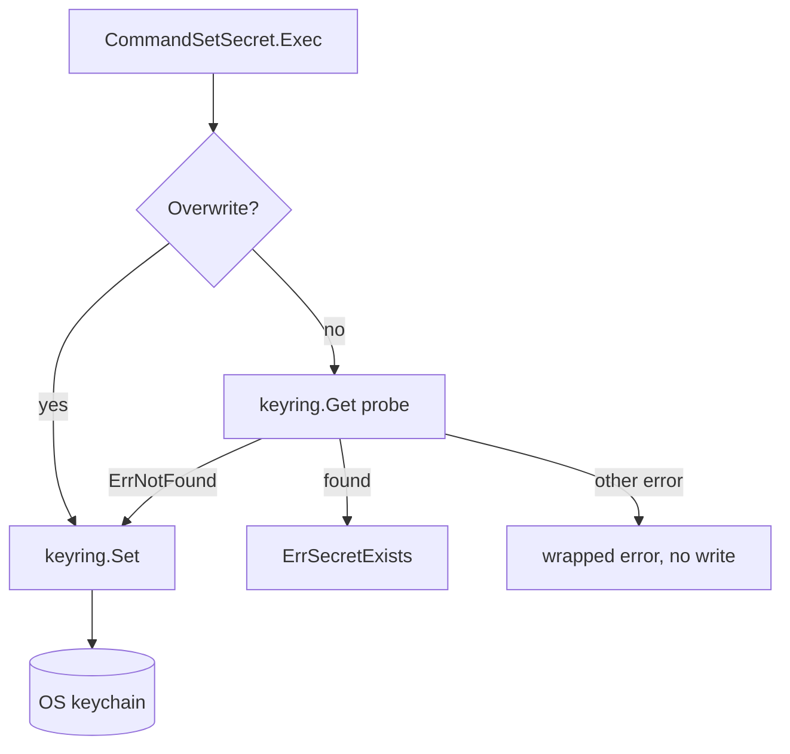

# `secrets` — OS keyring reads and writes

The `secrets` component is durable per-user credential storage, delegated in full to the platform
keychain through [`go-keyring`](https://github.com/zalando/go-keyring) — macOS Keychain, Windows
Credential Manager, Secret Service on Linux. There is no schema, no file and no `models/`: the
component is three operations over someone else's store, plus the launch check built on top of them.

**Not to be confused with [`sidecar/secrets`](../../secrets/handoff.go)**, which shares the package
name and nothing else. That one is the one-shot stdin handoff from the parent process, read once at
startup by [`main.go`](../../main.go) into [`envs`](../../envs/overrides.go) and never written back;
this one is durable and outlives the process. Neither imports the other, so a call site that wants
both needs an import alias. Unlike its sibling components [`application`](../application/README.md)
and [`timeline`](../timeline/README.md), this one resolves nothing from the service registry.

## Surface

| Symbol | Path | Role |
| --- | --- | --- |
| `QueryGetSecret` | [`get_secret.go`](get_secret.go) | `{Namespace, Key}` → `*string`; nil when the key is not set |
| `CommandSetSecret` | [`set_secret.go`](set_secret.go) | `{Namespace, Key, Value, Overwrite}` → writes, or refuses with `ErrSecretExists` |
| `CommandDeleteSecret` | [`delete_secret.go`](delete_secret.go) | `{Namespace, Key}` → removes; a key that is not there is already removed |
| `ErrSecretExists` | [`errors.go`](errors.go) | the one error a caller branches on: confirm, then retry with `Overwrite` |
| `QueryIsAuthenticated` | [`is_authenticated.go`](is_authenticated.go) | `{}` → bool; does the stored launch token match this process's environment? |
| `AssertAuthenticated` | [`assert_authn.go`](assert_authn.go) | the same question as a startup gate — panics instead of answering |

`(Namespace, Key)` is the identity — `Namespace` is the keyring's *service* and `Key` its *user*, so
the same key under two namespaces is two unrelated secrets. There is no `List`: the three backends
do not agree on enumeration, so a caller has to know its own keys.

## Absent, empty and failed

The load-bearing distinction. `keyring.ErrNotFound` is caught in all three keyring operations and
**never reaches a caller** — `QueryGetSecret` turns it into a nil pointer, `CommandDeleteSecret` into
success, `CommandSetSecret` into permission to write. Every *other* error is wrapped with `%w` and
returned as-is.

That split is also why the package contains no assertions at all. Every error here originates in an
out-of-process keychain daemon, which is external input, and [`AGENTS.md`](../../AGENTS.md) draws
the line there: assert what the type system cannot express, never what a daemon told you. An earlier
version asserted that `keyring.Get` had not failed *before* tolerating `ErrNotFound`, so an ordinary
"this secret is not set" panicked under `-tags assert` — which is how CI builds.

## Overwrite is an explicit decision

Probe-then-write is not atomic — no backend offers compare-and-set — so `Overwrite=false` is a guard
against the obvious mistake of silently replacing a live credential, not a lock. The arm that
matters is the third one: a keyring that *cannot answer* the probe is not an absent key, and
treating it as one would clobber a secret we merely failed to read.

> **Note:** an empty value reads back as absent. `utils.ZeroNil` collapses `""` to nil, so a secret
> deliberately stored as the empty string is indistinguishable from one that was never set. Do not
> store empty secrets to mean anything.

> **Note:** `ctx` and `svcs` are inert, kept only so the operation shape stays uniform with every
> other component — hence the `//nolint:revive` at each `Exec`. `go-keyring`'s API takes no context,
> so a hung Secret Service daemon is not cancellable; a real deadline would need the call moved to a
> goroutine, which is not written.

## The launch handshake

`QueryIsAuthenticated` is the one operation with a fixed identity — `sidecar_auth/token` — and the
only place in the component that reads [`envs`](../../envs/envs.go). It asks whether the token the
parent stored in the keychain equals `SIDECAR_LAUNCH_SECRET` in this process's environment, so a
sidecar started by anything other than the desktop app has nothing to match against.

Three unlike situations collapse into the same `false`: the token is absent, the keyring *failed* to
answer, and the values differ. This is the one caller that deliberately gives up the absent/failed
split above — it is deciding whether to run at all, and both answers are "not proven". An unset
environment variable gets its own arm rather than being left to the comparison: `utils.ZeroNil`
already makes a stored `""` read as absent, so `"" == ""` cannot happen today, and the explicit arm
is what keeps it from meaning *authenticated* if that ever changes. `AssertAuthenticated` turns the
`false` into a panic; a sidecar that cannot prove who launched it has no degraded mode worth
running.

> **Note:** `AssertAuthenticated` is not an `assert`-tag assertion despite the name — it is ordinary
> code that panics in a release build too. See [`AGENTS.md`](../../AGENTS.md) for the gated kind,
> which this package still contains none of.

> **Note:** `LAUNCH_TOKEN` is declared `Required()` with an empty default, so `ferrite` accepts a
> missing `SIDECAR_LAUNCH_SECRET` and startup does not fail — the zero check in
> `QueryIsAuthenticated` is what actually holds that line. Its description is empty too, and
> [`CONFIG.md`](../../CONFIG.md) has not been regenerated (`go tool task generate-env-docs`), so the
> variable is undocumented there.

> **Note:** the comparison is a plain `==`, not constant time.

> **Note:** nothing in this package has a caller yet. `AssertAuthenticated` is the intended entry
> point but [`main.go`](../../main.go) does not call it, so the sidecar still starts
> unauthenticated, and every secret it uses still resolves through the stdin handoff or the
> environment.

## Testing

`keyring.MockInit` reassigns an unsynchronised process-global provider, and the mock it installs
keeps its secrets in a map that is unsynchronised too. Distinct namespaces do not fix that — the
race is on the one shared map, not on the values in it. So every test goes through `useMockKeyring`
in [`secrets_test.go`](secrets_test.go), which holds a package mutex from the test body until
`t.Cleanup`: tests stay `t.Parallel()` per house style while the keyring section runs serially in
practice. A `TestMain` installs the mock once up front, so a test that forgets the fixture still
cannot reach a real keychain — CI's linux runner is headless with no Secret Service, and on a
developer's machine the real calls would write into their login keychain.

The launch handshake is the gap: `is_authenticated.go` and `assert_authn.go` have no tests, and
covering them needs the mock keyring *and* a `SIDECAR_LAUNCH_SECRET` set per case, which the fixture
does not do yet.

## Cross-cutting design themes

- **The platform owns the secret.** No encryption, no rotation, no at-rest story of our own —
  durability and ACLs are the OS's problem. That is what keeps this component thin enough to have
  no database, no converters and no models.
- **Absent is not an error.** The same stance as `QueryGetApplicationCategories` omitting an
  unclassified application, and as `utils.ZeroNil` mapping a zero value back to `NULL`: a nil
  pointer is an answer, an `error` means the mechanism broke. `QueryIsAuthenticated` is the one
  deliberate exception, and it collapses the two the safe way — a broken mechanism is not proof.
- **Assertions stop at the process boundary.** Everything here comes from a daemon out of process,
  so nothing in it is assertable. This package is the clearest example in the tree of the
  never-assert-on-external-input rule.
- **Two `secrets` packages, two lifetimes.** The handoff is per-launch and in memory; this is
  per-user and durable. Keeping them apart is why neither imports the other.
