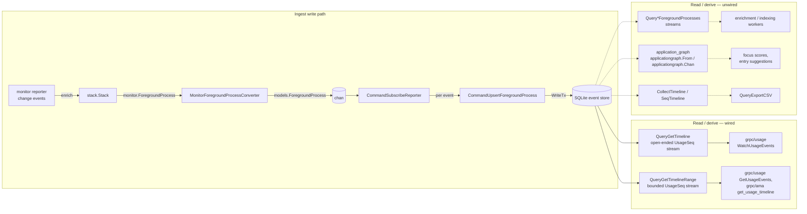
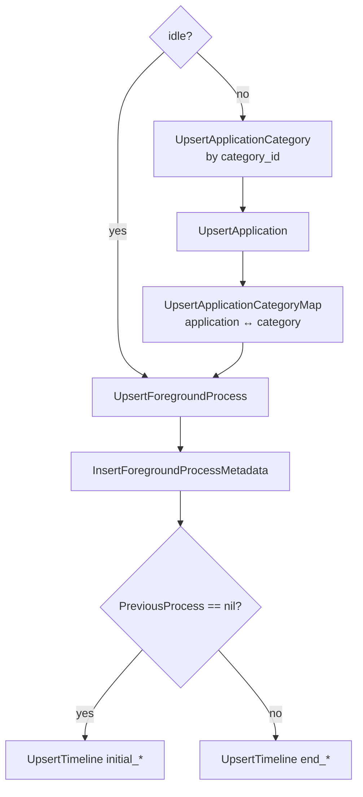

# `timeline` — foreground-process event store & analytics

The `timeline` component is the consumer end of the [`monitor`](../../monitor/README.md)
pipeline. It takes the stream of enriched foreground-process *change events*, persists each one
into the SQLite **event store**, and derives higher-level views from it: the timeline of
sessions, a re-enrichment/indexing backlog, CSV export, and an app-switch **graph** used for
focus scores and entry suggestions.

Everything is expressed over one domain type —
[`models.ForegroundProcess`](models/foreground_process.go) — the typed, persisted counterpart of
`monitor.ForegroundProcess`, with the enrichment bag resolved into concrete fields.

## Package map

| Package | Path | Role |
| --- | --- | --- |
| `timeline` | this dir | Command/query surface over the event store (ingest, streams, export, in-memory shaping) |
| `models` | [`models/`](models/) | Domain types (`ForegroundProcess`, `Enrichments`, `UsageSeq`, `TitleSource`, `Reason`) and the projection accessors (`Title`, `SourceName`, `ApplicationKey`, `Span`, `ReasonFor`) |
| `converters` | [`converters/`](converters/) | [goverter](https://github.com/jmattheis/goverter)-generated adapters: DB row → model, and `monitor.ForegroundProcess` → model |
| `application_graph` | [`application_graph/`](application_graph/) | Directed app-switch graph → focus scores, entry suggestions, productivity metrics |

The one component outside this tree it reads from is
[`application`](../application/README.md): a timeline row carries an application id, not its
category. Above it, [`grpc/usage`](../../grpc/usage/) maps a `UsageSeq` straight onto the wire
and [`grpc/ama`](../../grpc/ama/app_usage_tool.go) reads the same entries for its usage-timeline
tool.

## End-to-end data flow

Only the solid paths have production callers. The dashed subgraph is not uniformly ready — see
[Known gaps](#known-gaps).

Ingest is assembled in [`app/app.go`](../../app/app.go) → `startForegroundProjection`: it
subscribes to the reporter, enriches each change event, adapts it with
`MonitorForegroundProcessConverter`, and feeds a `chan models.ForegroundProcess` into
`CommandSubscribeReporter.Exec`, which runs one `CommandUpsertForegroundProcess` per event.
Shutdown is a single `ctx` cancel — the loop receives without a comma-ok check, so closing the
channel alone would not stop it; the `ctx.Done()` arm of its `select` is what terminates it.

The package follows a light CQRS split: each unit of work is a struct holding its inputs plus a
single method that resolves its dependencies from the `*services.Services` registry at call time.
`Command*` writes and returns `error`; `Query*` reads and returns either a value or a
`utils.StreamFn`. It is a structural convention rather than an interface — `QueryExportCSV`
wears the shape without honouring it, ignoring `svcs` because its input is already in memory.

## Ingest (`subscribe_reporter.go`, `upsert_foreground_process.go`)

`CommandSubscribeReporter` drains its `Chan` and threads the **previous** process into each
`CommandUpsertForegroundProcess`, so the upsert can tell "open a new session" from "close the
current one". The upsert persists one observation inside a single serialized `WriteTx`, in an
order that foreign keys dictate:

- **Category → application → map** run only for non-idle samples. The category is resolved
  against the seeded `application_categories` taxonomy by its natural key (the
  [`enums_categories`](../../enums/README.md) value) and linked through a many-to-many map.
- **Foreground process + metadata** are written for every sample, idle included;
  `application_id`/`pid` collapse to `NULL` when idle via `utils.ZeroNil`. `title_source` stores
  `NULL` rather than `TitleSourceUnknown.String()` — `"unknown"` is not a code
  `models.ParseTitleSource` accepts, so storing it would fail the read.
- **Timeline**: the first observation opens an entry (`initial_foreground_process_id`) and each
  subsequent one closes it (`end_foreground_process_id`). Entries therefore **chain** — an
  entry's closing observation is the next entry's opening one.

This is a streaming ingest of raw observations. It does not publish transition events or enqueue
semantic indexing inline; that work is deferred to the pull-based streams below.

## Timeline entry streams (`get_timeline.go`, `get_timeline_range.go`)

A `timeline` row is a *pair* of foreground processes, so
[`get_timeline.sql`](../../db/read_queries/get_timeline.sql) returns both endpoints side by side
as flat `initial_*` / `final_*` columns, keyset paginated on `timeline.id`. Each row becomes one
`UsageSeq{ID, Start, End, Killed}`. Both queries run that one SQL query and shape its rows
identically; they differ only in the bounds they pass:

| Query | Shape | Ends when |
| --- | --- | --- |
| `QueryGetTimeline` | optional `StartedAt`, no closing bound | **never** — an empty page reports `done == false` |
| `QueryGetTimelineRange` | `StartedAt` / `EndedAt` | the window is drained |

- **`End == nil` marks an open entry.** `timeline.end_foreground_process_id IS NULL` is the only
  reliable open/closed discriminator, and the whole final side is absent while it holds.
- **`MinDurationSeconds` filters out switch noise, and defaults to off.** It is a parameter
  rather than a constant because entries chain: dropping one punches a hole that hands its time
  to a neighbour. Pass `0` unless that cost has been weighed — the default is off precisely
  because the hole is invisible in the output.
  [`grpc/usage`](../../grpc/usage) is the one caller that pays it deliberately: both usage
  surfaces floor at one minute, because a shorter stretch still claims a full minute of block
  height on the timeline with the live *Now* marker inside it. `GetUsageEvents` passes the floor
  here; `WatchUsageEvents` applies the same one downstream of its debounce, so a refresh cannot
  resurrect what the live stream suppressed.
- **Bounds are strict on both sides** and compare instants, not text: `created_at_utc` carries
  whatever offset the observation was recorded in, so both sides go through
  `unixepoch(…, 'subsec')`. An open entry always passes the lower bound.
- **Every join is a `LEFT JOIN`**, which is load-bearing rather than defensive: an open entry
  has no final side, an idle observation has no application, and a non-browser observation has
  no browser category.
- **The application's category is not on the row.** Applications map to categories
  many-to-many, so joining would fan one entry out per classification. Each page resolves the
  distinct ids it mentions in one [`application`](../application/README.md) read and merges the
  result onto both endpoints.

`QueryGetTimeline` deliberately never terminates so `WatchUsageEvents` can stay open across a
quiet period — but it does not *follow* the ingest either. Nothing signals it when a new entry
lands, so an exhausted stream re-queries on the caller's paging cadence and only `ctx`
cancellation stops it. Note also the `done` contract of [`utils.Stream`](../../utils/README.md):
it *discards* the items handed back alongside `done == true`, so every terminating stream returns
a partial page with `done == false` and reports exhaustion on the next, empty call.

`UsageSeq.ID` carries `timeline.id` — both the keyset cursor and the identity consumers report
and deduplicate on.

## Backlog, in-memory shaping and export

Two further keyset streams walk the store for observations still needing work. **unenriched** is
narrower than the name suggests — a browser row with no `tab`, or a row with no coordinates but a
non-`NULL` `public_ip`; it says nothing about app category or browser vendor, which are enriched
at ingest rather than backfilled. **unindexed** matches rows neither of whose timeline endpoints
has a `timeline_semantic_documents` row. Both **inner** join `applications`, so an idle
observation can never surface in either.

`CollectTimeline` and `SeqTimeline` are the DB-free path: the first asserts its input is
timestamp-ascending and collapses **consecutive equal** observations (`ForegroundProcess.IsEqual`)
into a list of distinct states, the second walks that list producing `UsageSeq` neighbour triples.
`QueryExportCSV` renders such a list into eight columns — `appIdentifier, appPath, pid,
windowTitle, titleSource, timestamp, idle, killed` — deliberately the minimum from which every
other field can be re-derived. `AppName` is enrichment, recoverable and not stable across
re-enrichment, so exporting it would bake mutable derived state into the file.

## `models/` and `converters/`

`models.ForegroundProcess` mirrors the monitor type with resolved enrichments, and its accessors
carry the semantics: `IsIdle()`, `IsBrowser()` (non-zero browser enrichment), `IsEqual()` (the
change key `CollectTimeline` folds on), `Span()`, and `ReasonFor()`. `TitleSource` and `Reason`
are package-owned enums and stay here rather than under [`enums/`](../../enums/README.md).

Boundary mapping is generated (`//go:generate go tool goverter gen .`) across six converters —
the monitor type, both timeline row endpoints, both backlog rows, and the category merge. Two
things are worth knowing: the timeline row needs **two** converters rather than one with two
methods, because goverter resolves sub-mappings by `(source, target)` signature and initial/final
method sets over the same row type would be ambiguous; and `ApplicationCategoriesConverter` is a
`goverter:update` **merge**, not a conversion, because the category arrives from a separate read
and has to land on an `AppMetadata` a row converter already mapped.

## `application_graph/` — app-switch analytics

Builds a directed graph (backed by [`gograph`](https://github.com/hmdsefi/gograph)) whose
vertices are apps and whose edges are observed switches. Two constructors:
`applicationgraph.From(*list.List)` batch-builds from a `CollectTimeline` list, and
`applicationgraph.Chan(ctx, <-chan ForegroundProcess)` folds live observations in from a
goroutine.

Storage and traversal are generic — `BaseGraph[V, E]` holds the graph, the meta maps and an
exported `RWMu sync.RWMutex` — while everything app-specific sits behind a
`GraphConnectionStrategy`: how a process resolves to a vertex label, what meta accumulates, and
that the graph is directed. `ApplicationGraph` embeds `*BaseGraph[*VertexMeta, *EdgeMeta]` by
**pointer**, because `BaseGraph` carries the mutex. A second graph flavour is a new strategy,
not a second builder.

| Method | Returns |
| --- | --- |
| `GetFocusScores(n)` | `map[string]float64` — per-app focus metric (cycle-collapsed spans) |
| `GetEntrySuggestions(start, n)` | `[]EntrySuggestion` — contiguous app-cluster time blocks to log |
| `GetStronglyConnectedApps(n)` | `map[string][]StronglyConnectedEdgesMeta` — mutually-connected app clusters (**caller locks**) |
| `GetAverageProductiveDuration()` / `GetAverageUnproductiveDuration()` | `time.Duration` — split by `Category.IsProductive()` |
| `GetTimeToProductive()` | `time.Duration` — mean time spent unproductive before switching to a productive app |
| `GetVertexMeta(label)` / `GetEdgeMeta(from, to)` | `(*VertexMeta, bool)` / `(*EdgeMeta, bool)` |

`n` is `numMutualConnections`, the threshold for treating an app cluster as strongly connected
via Tarjan SCC. Both sides of the graph lock internally — with one deliberate exception.
**`GetStronglyConnectedApps` does not lock**, because `GetFocusScores` and
`GetEntrySuggestions` call it while already holding the read lock and re-acquiring would
deadlock. That is what `RWMu` is exported for: an external caller of that one method must hold
`RWMu.RLock()` itself.

## Known gaps

> **Unwired, and not uniformly verified.** [`application_graph`](application_graph/) has no
> production caller but is well covered by its own tests, and
> `QueryGetUnenrichedForegroundProcesses` has tests but no caller.
> `QueryGetUnindexedForegroundProcesses`, `CollectTimeline`, `SeqTimeline` and `QueryExportCSV`
> have **neither** — treat those four as unverified rather than merely unwired. Separately,
> `applicationgraph.Chan` folds from an unsynchronized goroutine with no done signal, so its
> tests skip under `-race`. Until an enrichment/indexing worker lands, semantic indexing runs off
> the [`semantic`](../../semantic/) backfiller and the [`queue`](../../queue/README.md) instead;
> the commented-out push-based wiring in `app/app.go` is stale and no longer re-enable-able as
> written.

> **Read but never written.** `foreground_process_metadata.killed` and `.browser_category` are
> selected by the read queries but absent from
> [`insert_foreground_process_metadata.sql`](../../db/write_queries/insert_foreground_process_metadata.sql),
> and there is nothing upstream to write them — `monitor.ForegroundProcess` has no `Killed` field
> and nothing on the ingest side classifies a browser tab. So on any DB-sourced entry `Killed` is
> always `false` and a browser entry carries no category. `models.Browser.AppIdentifier` is the
> same story: the graph prefers it as a browser's vertex label, but nothing populates it, so only
> the graph's own tests reach that branch. `Browser.Domain` is the inverse — captured and mapped,
> with no column to put it in. These are unbuilt features rather than wiring bugs; the code is
> written for the intended behaviour and currently sees zero values.

## Cross-cutting design themes

- **CQRS-ish surface.** `Command*`/`Query*` structs each own their inputs and pull DB
  dependencies from the service registry in `Exec`/`Stream`, so callers never wire queriers by
  hand.
- **The event store is the source of truth.** Every observation is persisted raw; the timeline,
  category links, graph and exports are all *derived* from it. Enrichment and indexing are
  designed as pull-based backlogs rather than inline work.
- **Entries chain.** A row's closing observation is the next row's opening one. That is what
  makes keyset pagination duplicate-free and category lookups naturally deduplicated — and it is
  why filtering entries by duration is a caller's decision, not the query's.
- **Absent vs empty, persisted.** Pointer identity fields survive the monitor→model boundary,
  and `utils.ZeroNil` maps idle zero-values back to `NULL` columns.
- **Generated boundaries.** Row→model and monitor→model conversions are goverter output; only
  genuinely custom logic is hand-written as pipe functions.
- **Category is a seeded taxonomy.** `application_categories` is seeded from `enums_categories`
  and resolved by natural key at ingest, so category data is consistent regardless of enrichment
  timing. The read parses the stored `code` back into the enum — which is why
  `enumscategories.Parse` has to stay the exact inverse of `String`.
