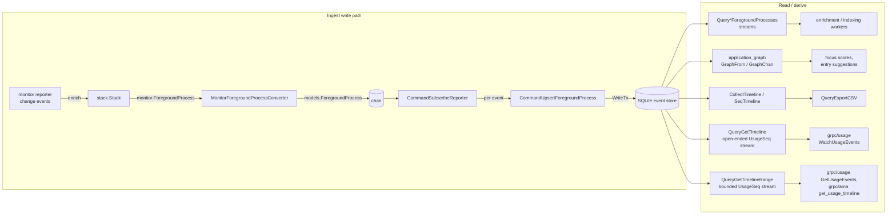
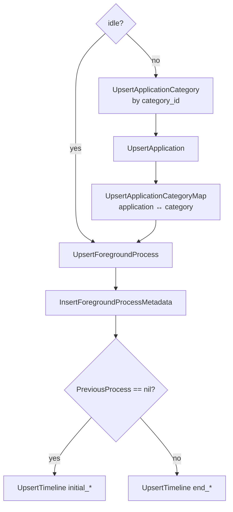

# `timeline` — foreground-process event store & analytics

The `timeline` component is the consumer end of the [`monitor`](../../monitor/README.md)
pipeline. It takes the stream of enriched foreground-process *change events*,
persists each one into the SQLite **event store**, and derives higher-level views
from it: the timeline of sessions, per-app category links, a re-enrichment/indexing
backlog, CSV export, and an app-switch **graph** used for focus scores and entry
suggestions.

Everything is expressed over one domain type —
[`models.ForegroundProcess`](models/foreground_process.go) — which is the typed,
persisted counterpart of `monitor.ForegroundProcess` (the enrichment bag resolved
into concrete fields).

## Command / Query convention

The package follows a light CQRS split. Each unit of work is a struct holding its
inputs plus a single method that resolves its dependencies from the
`*services.Services` registry at call time — via `db.FromServices(svcs)`, which is
where both the read and write queriers hang off:

| Shape | Method | Examples |
| --- | --- | --- |
| `Command*` (writes) | `Exec(ctx, svcs) error` | `CommandUpsertForegroundProcess`, `CommandSubscribeReporter` |
| `Query*` (reads) | `Exec(ctx, svcs) (T, error)` / `Stream(ctx, svcs) utils.StreamFn[…]` | `QueryExportCSV`, `QueryGetTimeline`, `QueryGetTimelineRange`, `QueryGetUnenrichedForegroundProcesses`, `QueryGetUnindexedForegroundProcesses` |

There is no named interface for this contract — it is a structural convention. The
free functions `CollectTimeline` / `SeqTimeline` are pure in-memory helpers with no
DB dependency.

Every `Stream` reports itself done once its pages run dry, and none of them stay open waiting
for more. A caller that wants the whole thing as a slice drains the stream itself — there is no
`Collect` on the query:

```go
entries := slices.Collect(utils.SeqChan(utils.Stream(ctx, pageSize, query.Stream(ctx, svcs))))
if err := ctx.Err(); err != nil {
	// a short slice means cancellation, not an empty window
}
```

## End-to-end data flow



The ingest side is assembled in [`app/app.go`](../../app/app.go) →
`startForegroundProjection`: it subscribes to the reporter, `enrich`-es each change
event, adapts it with `MonitorForegroundProcessConverter`, and feeds a
`chan models.ForegroundProcess` into `CommandSubscribeReporter.Exec`, which runs one
`CommandUpsertForegroundProcess` per event. Shutdown is a single `ctx` cancel that
closes the channel and exits the command loop.

## Package map

| Package | Path | Role |
| --- | --- | --- |
| `timeline` | this dir | Command/query surface over the event store (ingest, streams, export, in-memory shaping) |
| `models` | [`models/`](models/) | Typed domain types (`ForegroundProcess`, `Enrichments`, `UsageSeq`, `TitleSource`, `Reason`) + the projection accessors (`Title`, `SourceName`, `ApplicationKey`, `Span`, `ReasonFor`) |
| `converters` | [`converters/`](converters/) | [goverter](https://github.com/jmattheis/goverter)-generated adapters: DB row → model and `monitor.ForegroundProcess` → model |
| `application_graph` | [`application_graph/`](application_graph/) | Directed app-switch graph → focus scores, entry suggestions, productivity metrics |

The one component outside this tree it reads from is
[`application`](../application/): a timeline row carries an application id, not its
category, so each page of entries resolves the classifications of every application it
mentions in one `QueryGetApplicationCategories` read and merges them onto each endpoint.

There is no reporting component above this one. [`grpc/usage`](../../grpc/usage/) maps a
`UsageSeq` straight onto the wire — title, source and reason are all derived from the entry's
opening observation by `models` — and [`grpc/ama`](../../grpc/ama/app_usage_tool.go) reads the
same entries for its usage-timeline tool.

## Ingest (`subscribe_reporter.go`, `upsert_foreground_process.go`)

[`CommandSubscribeReporter`](subscribe_reporter.go) is a long-running loop. It drains
its `Chan <-chan models.ForegroundProcess`, and for each event runs a
`CommandUpsertForegroundProcess`, threading the **previous** process as
`PreviousProcess` so the upsert can tell "open a new session" from "close the current
one". It exits on `ctx.Done()`.

[`CommandUpsertForegroundProcess.Exec`](upsert_foreground_process.go) persists one
observation inside a single serialized `WriteTx`. Ordering matters because of foreign
keys:



- **Category → application → map** run only for non-idle samples (an idle sample has
  no app). The category comes from `Enrichments.Appmetadata.Category`; it is resolved
  against the seeded `application_categories` taxonomy by its natural key
  (`category_id`, the [`enums_categories`](../../enums/enums_categories/category.go)
  value), and the returned surrogate id is linked to the application via
  `application_application_categories_map`.
- **Foreground process + metadata** are written for every sample (idle included);
  `application_id`/`pid` collapse to `NULL` when idle via `utils.ZeroNil`.
- **Timeline**: the first observation opens an entry (`initial_foreground_process_id`);
  each subsequent observation closes the open entry
  (`end_foreground_process_id`). Boundary rows are shared through the
  `created_at_utc` upsert on `foreground_processes`.

> This is the streaming Command ingest. It records raw observations and defers
> enrichment/indexing to the pull-based streams below; it does not publish transition
> events or enqueue semantic indexing inline.

## Re-enrichment & indexing streams (`get_unenriched_*.go`, `get_unindexed_*.go`)

`QueryGetUnenrichedForegroundProcesses` and `QueryGetUnindexedForegroundProcesses`
each expose `Stream(ctx, svcs) utils.StreamFn[models.ForegroundProcess]` — a
keyset-paginated closure that walks the event store for observations still needing
work:

- **unenriched** — rows whose metadata has not yet been decorated (app category,
  browser vendor, …).
- **unindexed** — rows not yet turned into semantic documents/embeddings.

Each page is fetched via the corresponding `read_queries` query (keyed off the last
seen `foreground_process` id), and every row is turned into a `models.ForegroundProcess`
by the matching `converters` row converter. These feed background workers that pull
work rather than being pushed to.

## Timeline entry streams (`get_timeline.go`, `get_timeline_range.go`)

These are the streams that do **not** yield single observations: a `timeline` row is a *pair*
of foreground processes, so [`GetTimeline`](../../db/read_queries/get_timeline.sql) returns
both endpoints of an entry side by side as flat `initial_*` / `final_*` columns, keyset
paginated on `timeline.id`, and each row becomes one `UsageSeq{ID, Start, End, Killed}`. Both
queries run that one SQL query and shape its rows the same way; they differ only in which
bounds they pass:

| Query | Shape | Ends when |
| --- | --- | --- |
| `QueryGetTimeline` | optional `StartedAt`, no closing bound | its pages run dry |
| `QueryGetTimelineRange` | `StartedAt`/`EndedAt` | the window is drained |

Neither one follows the ingest: an empty page is the end of the stream, so a consumer that
wants the entries recorded since it last looked asks again with a fresh query. Keyset
pagination is what makes that cheap and duplicate-free — the cursor only ever moves forward, so
no consumer has to deduplicate.

- **`End == nil` marks an open entry.** An entry is open until an observation closes it
  (`timeline.end_foreground_process_id IS NULL`), so the whole final side is absent; the
  query gates on that column, which is the only reliable open/closed discriminator.
- **`MinDurationSeconds` filters out switch noise**, and defaults to off. It is a parameter
  rather than a constant because entries *chain*: an entry's closing observation is the next
  entry's opening one, so dropping one punches a hole that hands its time to a neighbour.
  Consumers that derive durations from that adjacency — the reporting surfaces in `grpc/` —
  must pass `0`.
- **`StartedAt` / `EndedAt` bound the stream to a window**, half-open and strict, comparing
  instants rather than text: `created_at_utc` carries whatever offset the observation was
  recorded in, so both sides of each bound go through `unixepoch(…, 'subsec')`.
  `QueryGetTimeline` passes no upper bound. An open entry has not ended, so it always passes
  the lower bound.
- **Every join is a `LEFT JOIN`**, which is load-bearing rather than defensive: an open entry
  has no final side, an idle observation has no application, and a non-browser observation has
  no browser category. Inner joins here silently drop exactly the rows the `WHERE` admits.
- **The application's category is not on the row.** An application maps to categories
  many-to-many, so joining it in would fan one entry out into a duplicate per classification.
  The row carries `application_id`, and each page collects the distinct ids it mentions and
  resolves them all in one
  [`QueryGetApplicationCategories`](../application/get_application_categories.go) read —
  deduplicated because entries chain, so a row's closing observation is the next row's opening
  one. `ApplicationCategoriesConverter` merges the result onto both endpoints.
- `Killed` comes from the closing observation (the span ended because the app was terminated),
  and stays `false` while the entry is open.

`UsageSeq.ID` carries `timeline.id` — it is both the keyset cursor and the identity consumers
report and deduplicate on (semantic documents, embeddings, the usage event id on the wire).
The purely in-memory `SeqTimeline` leaves it zero, since observations held in memory were
never entries.

Note the `done` contract: [`utils.Stream`](../../utils/stream.go) *discards* the items it is
handed once a closure reports itself done, so every terminating stream returns a partial page
with `done == false` and reports exhaustion on the next (empty) call.

To feed the [`application_graph`](application_graph/) from the store, collect a window and
rebuild the observation sequence from it: drain `QueryGetTimelineRange` → each entry's
`Start` (plus the last entry's `End`) → `CollectTimeline` → `GraphFrom`. The graph labels an
observation by its application identifier and dereferences it unconditionally, so the caller
owns filling one in.

## In-memory timeline shaping (`foreground_process.go`)

Pure helpers over a sorted slice of observations (no DB):

- `CollectTimeline(stream) *list.List` — asserts the input is timestamp-ascending and
  collapses **consecutive equal** observations (`ForegroundProcess.IsEqual`) into a
  linked list of distinct states.
- `SeqTimeline(list) []models.UsageSeq` — walks the list producing
  `UsageSeq{Start, End, Killed}` neighbor triples (previous/next around each node),
  the shape the graph and duration math consume.

## CSV export (`export_csv.go`)

`QueryExportCSV{Timeline list.List}.Exec` renders a linked list of observations into
a CSV string (header + one row per process: identifiers, pid, window title, title
source, timestamp, idle, killed).

## `models/` — domain types

[`models.ForegroundProcess`](models/foreground_process.go) mirrors the monitor type
but with resolved enrichments:

```go
type ForegroundProcess struct {
    AppName, AppIdentifier, AppPath *string
    PID                             *int64
    WindowTitle                     *string
    TitleSource                     *TitleSource
    Timestamp                       time.Time
    Idle, Killed                    bool
    Enrichments                     Enrichments // Appmetadata / Browser / Location
}
```

Enrichment sub-structs: `AppMetadata` (FriendlyName, Description, `Category`, IconPath,
Source), `Browser` (Vendor, `Category`, Tab, CdpURL, Domain), `Location` (nullable
lat/long + public IP). Accessors carry the semantics: `IsIdle()` (asserts identity
fields are nil when idle), `IsBrowser()` (non-zero browser enrichment), `IsEqual()`
(the change-key used by `CollectTimeline`), and `Category.IsProductive()` (drives the
graph's productive/unproductive split). `UsageSeq` is the neighbor-triple type;
`Usage.IsKilled()` reports termination.

## `converters/` — goverter adapters

Boundary mapping is generated, not hand-written (`//go:generate go tool goverter gen .`).
Each converter is an annotated interface compiled to an exported zero-size struct with
a `ToForegroundProcess` method:

| Converter | Source | Used by |
| --- | --- | --- |
| `MonitorForegroundProcessConverter` | `monitor.ForegroundProcess` | ingest (`app.go`) — resolves the enrichment bag (app-metadata category, browser, location) into typed fields |
| `GetUnenrichedForegroundProcessesRowConverter` | `readqueries.GetUnenrichedForegroundProcessesRow` | unenriched stream |
| `GetUnindexedForegroundProcessesRowConverter` | `readqueries.GetUnindexedForegroundProcessesRow` | unindexed stream |
| `GetTimelineInitialRowConverter` / `GetTimelineFinalRowConverter` | `readqueries.GetTimelineRow` | timeline entry stream — one converter per endpoint |
| `ApplicationCategoriesConverter` | `applicationmodels.ApplicationCategories` | timeline entry stream — merges the looked-up category onto an already-mapped `AppMetadata` |

The timeline row needs **two** converters rather than one with two methods: goverter resolves
sub-mappings by `(source, target)` signature, so initial and final method sets on a single
converter over the same row type would be an ambiguous match.

`ApplicationCategoriesConverter` is the odd one out: it is a `goverter:update` method rather
than a conversion, because the category arrives from a separate read and has to land on an
enrichment a row converter already mapped. Everything it does not map is left untouched, which
is what makes it a merge rather than a replacement.

Non-trivial mappings are pipe functions in [`converters.go`](converters/converters.go):
`monitorEnrichments` (reads the `app_metadata`/`browser`/`location` bag entries),
`appmetadataCategory` (numeric cast between the two identically-ordered `Category`
enums), `firstCategory` (collapses an application's classifications to the single category the
model carries), `pidInt32ToInt64`, `parseTitleSource`, `parseBrowserCategory`, `zeroNilString`.
`parseOptionalTitleSource` / `parseOptionalBrowserCategory` are the left-join variants of the
two parsers: they treat an absent code as "no value" instead of asserting, since an idle
observation has no title source and a non-browser observation has no browser category.

## `application_graph/` — app-switch analytics

Builds a directed graph (backed by [`gograph`](https://github.com/hmdsefi/gograph))
whose vertices are apps and whose edges are observed switches, guarded by an embedded
`sync.RWMutex`. Two constructors:

- `GraphFrom(*list.List)` — batch-build from a `CollectTimeline` list.
- `GraphChan(ctx, <-chan ForegroundProcess)` — incremental; a goroutine folds live
  observations in.

Vertex/edge meta accumulate duration, visit/switch counts, intervals, and category.
Analytics methods (each takes `numMutualConnections`, the threshold for treating an
app cluster as strongly connected via Tarjan SCC):

| Method | Returns |
| --- | --- |
| `GetFocusScores(n)` | `map[string]float64` — per-app focus metric (cycle-collapsed spans) |
| `GetEntrySuggestions(start, n)` | `[]EntrySuggestion` — contiguous app-cluster time blocks to log |
| `GetStronglyConnectedApps(n)` | `map[string][]StronglyConnectedEdgesMeta` — mutually-connected app clusters |
| `GetAverageProductiveDuration()` / `GetAverageUnproductiveDuration()` | `time.Duration` — split by `Category.IsProductive()` |
| `GetTimeToProductive()` | `time.Duration` |
| `GetVertexMeta(label)` / `GetEdgeMeta(from, to)` | accumulated meta for one node/edge |

## Cross-cutting design themes

- **CQRS-ish surface.** `Command*`/`Query*` structs each own their inputs and pull
  DB dependencies from the service registry in `Exec`/`Stream`, so callers never wire
  queriers by hand.
- **The event store is the source of truth.** Every observation is persisted raw;
  the timeline, category links, graph, and exports are all *derived* from it, and
  enrichment/indexing are pull-based backlogs rather than inline work.
- **Absent vs empty, persisted.** Pointer identity fields survive the monitor→model
  boundary, and `utils.ZeroNil` maps idle zero-values back to `NULL` columns.
- **Generated boundaries.** Row→model and monitor→model conversions are goverter
  output; only genuinely custom logic (enrichment-bag resolution, enum widening) is
  hand-written as pipe functions.
- **Category is a seeded taxonomy.** `application_categories` is seeded from
  `enums_categories`; ingest resolves by the natural key and links apps through a
  many-to-many map, so category data is consistent regardless of enrichment timing.
  The read goes the other way, parsing the stored `code` back into the enum — which is
  why `enumscategories.Parse` has to stay the exact inverse of `String`.
