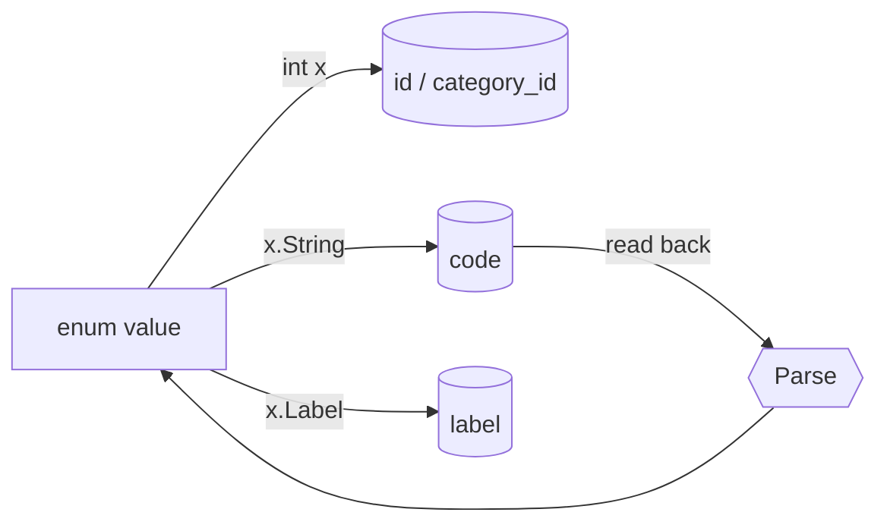

# `enums` — the sidecar's cross-cutting enumerations

The `enums` tree holds the enumerations that more than one package needs. Each one is a
directory containing a single hand-written file: **no code generation, no `stringer`, no
`enumer`**, and nothing imported beyond `fmt` and `strings`. An enum small enough to read in
one screen does not need a generator, and keeping them generator-free means the const block,
the codes and the parser are always visible together.

They are deliberately narrow. An enum here is an `int` with a name, a code, and a way back
from that code — it is not a serialization framework. Everything else (SQL, JSON, gRPC) is
done explicitly at the boundary that needs it. An enum owned by a single package does **not**
live here — it stays beside its domain type and takes a `Parse<Thing>` name instead, the way
`timeline/models` keeps `ParseTitleSource` and `ParseReason`.

## The enums

| Directory | Package | Type | Index `0` | Codes |
| --- | --- | --- | --- | --- |
| [`enums_categories`](enums_categories/category.go) | `enumscategories` | `Category` | `CategoryUnknown` — sentinel | kebab-case (`web-browsing`) |
| [`enums_env`](enums_env/env.go) | `enumsenv` | `Environment` | `Production` — meaningful | lowercase (`production`) |
| [`enums_journal_mode`](enums_journal_mode/journal_mode.go) | `enumsjournalmode` | `JournalMode` | `Delete` — meaningful | SQLite pragma tokens (`WAL`) |
| [`enums_masking_category`](enums_masking_category/masking_category.go) | `enumsmaskingcategory` | `MaskingCategory` | `Unknown` — sentinel | snake_case (`browser_domain`) |
| [`enums_operating_system`](enums_operating_system/operating_system.go) | `enumsoperatingsystem` | `OperatingSystem` | `Unknown` — sentinel | lowercase (`macos`) |
| [`enums_release_channel`](enums_release_channel/release_channel.go) | `enumsreleasechannel` | `ReleaseChannel` | `Unknown` — sentinel | lowercase (`stable`) |
| [`enums_semantic_document_type`](enums_semantic_document_type/semantic_document_type.go) | `enumssemanticdocumenttype` | `SemanticDocumentType` | `Unknown` — sentinel | snake_case (`day_summary`) |

`enums_categories` is by far the largest — it carries `Label()`, `IsProductive()` and a set of
foreign-taxonomy adapters. The other six are the bare shape below. `enums_release_channel` has
no Go importers today; it exists for the seeded `release_channels` table the desktop app reads.
`enums_masking_category` is the only one that persists its code rather than its integer — see
[the persistence contract](#the-persistence-contract).

## The shape

[`enums_semantic_document_type`](enums_semantic_document_type/semantic_document_type.go) is the
archetype — the whole convention fits in one file, with `fmt` and `strings` the only imports:

```go
type SemanticDocumentType int

const (
	Unknown SemanticDocumentType = iota
	Event
	DaySummary
	AppDaySummary
	TimeBlockSummary
)

func (documentType SemanticDocumentType) String() string {
	return []string{"unknown", "event", "day_summary", "app_day_summary", "time_block_summary"}[documentType]
}

func Parse(s string) (SemanticDocumentType, error) {
	switch strings.ToLower(strings.TrimSpace(s)) {
	case "event":
		return Event, nil
	case "day_summary":
		return DaySummary, nil
	case "app_day_summary":
		return AppDaySummary, nil
	case "time_block_summary":
		return TimeBlockSummary, nil
	}

	return Unknown, fmt.Errorf("unrecognized semantic document type: %s", s)
}
```

- **`type X int`, always.** Never a string type, never a struct. The integer is the value that
  crosses into SQLite — as a row id wherever the enum is seeded — and into gRPC as an `int32`; the
  string is a rendering of it, not the thing itself.
- **One `const` block, first member `= iota`, the rest bare.** No explicit values, no gaps, no
  bit flags.
- **`String()` is an index into a slice literal ordered to match the iota block** — never a
  `switch`. The positional coupling is the point: a member added in one place and forgotten in
  the other is visible on sight.
- **`Parse(s string) (X, error)`** — package level, named exactly `Parse`, never `ParseX` or
  `FromString`. It normalises with `strings.ToLower(strings.TrimSpace(s))`, carries no
  `default:` clause, and closes with a bare
  `return <safe default>, fmt.Errorf("unrecognized <thing>: %s", s)`.
- **Only `fmt` and `strings` are imported.** An enum reaching for a third import is a sign the
  logic belongs at the call site.

## Naming

Directories are snake_case and the package clause drops the underscores —
`enums_release_channel` declares `package enumsreleasechannel` — so every import site aliases
explicitly with an all-lowercase alias matching the package name. The alias is redundant to the
compiler and mandatory for the reader; it is what makes the directory and the qualifier line up
at a glance.

Constant names are bare by default, since the aliased package already carries the noun
(`enumsjournalmode.WAL`). `enums_categories` type-prefixes its members (`CategoryUnknown`,
`CategoryGames`) because a lone `Games` reads poorly beside the many other identifiers in the
ingest path. `String()` is the storage code and `Label()` is the human string — never overload
`String()` for display; `Category.String()` yields `"graphics-design"` where `Label()` yields
`"Graphics & Design"`. Codes are persisted and compared, so changing one is a migration, not a
rename.

## Zero value: sentinel or safe default

**Index `0` is either an `Unknown` sentinel or the safe default — never an arbitrary member.**
A value that arrives zeroed must land somewhere harmless, so position zero is a decision, not
whichever constant happened to be written first.

Which of the two an enum picks depends on whether "unset" is a real state. `Category`,
`MaskingCategory`, `OperatingSystem`, `ReleaseChannel` and `SemanticDocumentType` all need to
represent *not classified yet*, so they open with `Unknown`. `Environment` and `JournalMode` never
have an absent value — every process runs in some environment and every database opens in some
journal mode — so their index zero is a real member.

**`Parse` returns the safe default on failure, which is not always the zero value.** Where a
sentinel exists it is the natural answer, but [`enums_env`](enums_env/env.go) returns
`Development` and [`enums_journal_mode`](enums_journal_mode/journal_mode.go) returns `WAL` — the
conservative choice for that domain rather than index zero. The error still comes back alongside
it; the value is there so a caller that logs and continues degrades sensibly.

At the persistence boundary the sentinel doubles as *absent*: `utils.ZeroNil(category)`
collapses `CategoryUnknown` to a `NULL` column, the shared "nil means absent, zero means empty"
convention documented in [`utils`](../utils/README.md).

## The persistence contract

This is the invariant that makes the rest of the convention load-bearing. Most enums under
`enums/` back seeded reference tables:



- **The enum's integer *is* the row's identity in its seeded table.** For
  [`operating_systems`](../db/seeds/operating_systems/000001_initial_operating_systems.up.sql),
  [`release_channels`](../db/seeds/release_channels/000001_initial_release_channels.up.sql) and
  [`semantic_document_types`](../db/seeds/semantic_document_types/000001_initial_document_types.up.sql)
  that is the primary key — `semantic/documents.go` resolves a document type with a plain
  `int64(documentType)` cast and no lookup. For
  [`application_categories`](../db/seeds/application_categories/000001_initial_application_categories.up.sql)
  it is the unique `category_id` natural key.
- **One enum persists its code instead.** `enums_masking_category` has no seeded table:
  `masked_values.masking_category` stores `String()` and the read parses it back, the way
  `foreground_process_metadata.title_source` does for a package-owned enum. Its iota positions
  never reach a column, but the const block stays append-only like the rest — the codes are what
  is frozen.
- **In a seeded table the integer is always a column; the code and label are columns where the
  table has them.** Only `application_categories` carries all three. `semantic_document_types` is
  `(id, code)`, `release_channels` is `(id, label)`, and `operating_systems` is `(id, code, label)`
  — but its `code` holds a `GOOS` token rather than `String()`'s output.
- **The order is frozen: append only.** Never reorder, delete or renumber a member. Every
  existing row is keyed on the position a constant holds today, and the seeds re-assert those ids
  on every startup. Where the sentinel is a real classification it is seeded and where it means
  "no row" it is not — `application_categories` seeds `category_id = 0` as `unknown` because an
  unclassifiable application still needs a row to point at; the other three start at id `1`.
- **`Parse` must be a total inverse of `String()` for any enum read back out of the database.**
  `enums_categories` carries the only doc comment in the tree, and it says exactly this. The
  consequence is that its `Parse` accepts `"unknown"` — a sentinel that could not round-trip
  would make every read of an unclassified row an error. `enums_masking_category` is read back too
  but never stores its sentinel, so its `Parse` rejects `"unknown"`: the same choice `title_source`
  makes by storing `NULL` rather than the code.
- **`Parse` accepts the vocabulary of whatever supplies the value**, which is not always the
  vocabulary `String()` emits. `enums_operating_system.Parse` takes `runtime.GOOS` tokens
  because that is its only input; `enums_journal_mode.Parse` takes SQLite pragma names.

`String()` also feeds configuration surfaces — [`envs`](../envs/envs.go) builds the `GO_ENV`
variable's members out of `enumsenv.Production.String()` and friends, so the environment names
the process accepts and the constants in the enum cannot drift apart.

> **Note: two enums do not round-trip today.** `enums_operating_system` is deliberate —
> `MacOS.String()` is `"macos"` but `Parse` only accepts `darwin`/`windows`/`linux`, and the
> seeded code is `darwin`, so `String()` is effectively display-only for this one.
> `enums_journal_mode` is not deliberate: `Off.String()` is `"OFF"` but `Parse` has no `"off"`
> case, so the value cannot be read back. Neither enum is read out of a column today, which is
> why nothing has broken.

## What enums deliberately do not implement

> **Note:** `fmt.Stringer` is the only *interface* an enum in this tree implements. There is no
> `driver.Valuer` or `sql.Scanner` (the integer is written directly as an id, and the code is
> written as its own column), no `MarshalJSON`/`UnmarshalJSON`, no YAML hooks, no
> `Values()`/`All()` slice, no `IsValid()`, and no `//go:generate`. Each of those would add a
> second, quieter definition of what the enum means.

Plain methods are fair game where the domain rule genuinely belongs to the enum.
`Category` carries two beyond `String()`: `Label()` for display, and `IsProductive()`, which
splits the taxonomy into productive (Development, Productivity, Graphics & Design, Business,
Education) and everything else. That predicate is what drives the productive/unproductive
metrics in
[`application_graph`](../components/timeline/README.md#application_graph--app-switch-analytics).
It is written as an exhaustive switch over every member specifically so that adding a category
without deciding which side it falls on is visible.

## Adapters — `Parse<Source>`

When a foreign taxonomy has to be folded into one of ours, it gets its own parser next to
`Parse` rather than extra cases inside it. [`enums_categories`](enums_categories/category.go) is
the worked example, mapping the Apple (`ParseAppleCategory`), freedesktop
(`ParseFreedesktopCategory`, `ParseFreedesktopCategories`) and winget (`ParseWingetKeyword`,
`ParseWingetTags`) vocabularies onto `Category`. Each takes the same `(Category, error)`
signature and the same error idiom as `Parse`, sits under a provenance comment naming the spec
URL and any prefix or subcategory rule, and collapses synonyms with multi-value cases
(`case "business", "finance":`) rather than one case per token. Keeping them separate is what
holds the canonical round-trip exactly as wide as the codes we emit.

A plural variant states its pick strategy, and the two differ:
`ParseFreedesktopCategories` parses a `;`-separated list and keeps the **last** match — the most
specific entry in that format — while `ParseWingetTags` keeps the **first** match across the tag
list.

## Adding an enum

1. Create `enums/enums_<thing>/<thing>.go` with `package enums<thing>` — the directory name
   without underscores. Declare `type <Thing> int` and one `const` block starting at `iota`,
   with the sentinel or the safe default in position zero.
2. Write `String()` as a slice-literal index in iota order, and `Parse` with no `default:`
   clause, closing on the safe default and `fmt.Errorf("unrecognized <thing>: %s", s)`.
3. If the enum is persisted as a row id, add its schema table and a seed under
   [`db/seeds/`](../db/seeds) whose ids match the const block. If it is persisted as a code in an
   ordinary column there is no table — just make `Parse` total over every code that column can
   hold.
4. Alias the import at every call site.

## Cross-cutting design themes

- **The integer is the identity; the string is a rendering.** The value that persists, joins
  and crosses the wire is the iota index — `enums_masking_category` is the one that stores its code
  instead. `String()` and `Label()` describe it for a column or a human — neither is the enum's
  identity, which is why the type is always `int`.
- **Ordering is schema, not style.** The const block is mirrored by the `String()` slice and,
  where the enum is seeded, by a table of ids. Reordering it is a data migration, so members are
  only ever appended.
- **`Parse` is the single door in.** Every external string — an env var, a `GOOS` token, a
  column read back from SQLite, a third-party taxonomy — becomes an enum through a `Parse*`
  function that trims, lowercases and validates. Nothing else constructs one from text.
- **The safe default is a per-enum decision.** What `Parse` hands back on failure is chosen for
  the domain, not inherited from Go's zero value, and the error always comes back with it.
- **Hand-written and dependency-free.** Seven files, two imports between them, no generator step
  and nothing to regenerate — the cost of an enum staying this small is that every conversion
  is written out where it happens.
- **Narrow on purpose.** One interface, and domain predicates only where the rule is genuinely
  the enum's. Each interface an enum does not implement is a conversion the calling boundary has
  to make deliberately, in code you can see.
