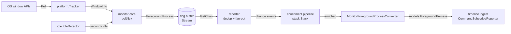

# `monitor` — foreground capture pipeline

The `monitor` module captures what the user is doing right now: it polls the OS
for the active window, detects idle, decorates each sample with derived context
(app metadata, browser tab/URL, location), and hands a stream of *change events*
to the timeline. It is the source of every observation that the
[`timeline`](../components/timeline/README.md) component turns into a persisted
timeline entry.

Everything downstream depends on one type — [`monitor.ForegroundProcess`](monitor.go)
— flowing through the cooperating packages listed in the package map below.

## End-to-end data flow



The pipeline is assembled in [`app/app.go`](../app/app.go) →
`startForegroundProjection` ([app.go:131-168](../app/app.go#L131-L168), called from
[app.go:126](../app/app.go#L126)):

1. `stack.Stack()` builds the enrichment `Enricher` + the permission list.
2. `monitor.New(ctx, Options{Permissions})` starts the poll goroutine and
   requests those permissions.
3. `reporter.From(ctx, m.Stream)` starts the single consumer of the ring buffer. It
   returns `(*PubSubReporter, func())`; the call site **discards the cleanup func**
   ([app.go:143](../app/app.go#L143)) because shutdown rides on `ctx` instead.
4. `pubsub.Subscribe("timeline")` yields a change-event channel that a goroutine
   drains, `enrich`-es, adapts to `models.ForegroundProcess` via
   `MonitorForegroundProcessConverter`, and feeds a channel consumed by the
   [`timeline`](../components/timeline/README.md) ingest command
   (`CommandSubscribeReporter` → `CommandUpsertForegroundProcess`).

Each observation lands in **one write transaction**
([upsert_foreground_process.go:30-109](../components/timeline/upsert_foreground_process.go#L30-L109)):

- only when *not* idle: `UpsertApplicationCategory` → `UpsertApplication` →
  `UpsertApplicationCategoryMap` (an idle sample has no app identity, so all three
  are skipped and the foreground-process row gets a null application/PID);
- always: `UpsertForegroundProcess`, then `InsertForegroundProcessMetadata` (browser
  and idle flags, tab, CDP URL, lat/long, public IP);
- then `UpsertTimeline` — `InitialForegroundProcessID` on the very first observation,
  `EndForegroundProcessID` on every one after it. `CommandSubscribeReporter` carries
  the last-seen process forward as `PreviousProcess`, and it is that field being `nil`
  that selects the first branch.

Shutdown is a single `ctx` cancel observed independently at each stage: the poll
loop stops the ring buffer, the reporter goroutine closes its subscriber channels,
and the enrich/convert loop returns and closes its output channel. The ingest loop
exits on the *same* `ctx`, not on that close —
[`subscribe_reporter.go`](../components/timeline/subscribe_reporter.go) receives
without a comma-ok check, so a closed input channel would otherwise yield zero
values forever; it is the `ctx.Done()` arm of its `select` that ends it.

## Package map

| Package | Path | Role |
| --- | --- | --- |
| `monitor` | [`monitor.go`](monitor.go) | Core producer: poll loop, `ForegroundProcess`, ring buffer |
| `platform` | [`platform/`](platform/) | Per-OS active-window tracker (`Tracker`) |
| `idle` | [`idle/`](idle/) | Per-OS idle detection (`IdleDetector`) |
| `permission` | [`permission/`](permission/) | Shared permission vocabulary (stdlib-only leaf) |
| `reporter` | [`reporter/`](reporter/) | Pub/sub fan-out with per-subscriber change-dedup |
| `enrichment` | [`enrichment/`](enrichment/) | `Enricher` combinator kit (`Pipe`, `Or`, `Merge`) |
| `enrichment/app_metadata` | [`enrichment/app_metadata/`](enrichment/app_metadata/) | Friendly name, category, icon (local + Flathub/Winget feeds) |
| `enrichment/browser` | [`enrichment/browser/`](enrichment/browser/) | Browser detection + tab title/URL via CDP |
| `enrichment/location` | [`enrichment/location/`](enrichment/location/) | Lat/long + public IP |
| `enrichment/stack` | [`enrichment/stack/`](enrichment/stack/) | Assembles the default pipeline + permission set |
| `internal/wlproto` | [`internal/wlproto/`](internal/wlproto/) | Generated Wayland protocol bindings (`wlr`, `plasma`, `ext`) |

> **Go 1.26 note:** this module (`go 1.26.4`) uses the `new(expr)` builtin — a
> pointer to a *copy of a value*, not a zero of a type. That is why
> `new(windowInfo.AppName)` and `new(incoming)` appear throughout; there is no
> custom `new` helper.

## Core capture (`monitor.go`)

`ForegroundProcess` ([monitor.go:15-25](monitor.go#L15-L25)) is the unit of data.
Identity fields are **pointers** so "absent" is distinguishable from "empty" — an
idle sample leaves them all `nil`:

```go
type ForegroundProcess struct {
    AppName, AppIdentifier, AppPath *string
    PID                             *int32
    WindowTitle                     *string
    TitleSource                     *platform.TitleSource
    Timestamp                       time.Time
    Idle                            bool
    Enrichments                     map[string]any  // decorated downstream
}
```

`Options` ([monitor.go:27-32](monitor.go#L27-L32)) is how the caller tunes it — the
three tunables are **pointers** so `nil` means "use the default", resolved through
`utils.Coalesce`:

```go
type Options struct {
    PollInterval *time.Duration   // default 200ms
    IdleAfter    *time.Duration   // default 5min
    BufferSize   *int             // default 10 (≈2s of samples)
    Permissions  []permission.Permission
}
```

`New` ([monitor.go:41-74](monitor.go#L41-L74)) constructs the tracker and idle
detector, requests permissions, applies those defaults, builds the ring buffer, and
launches the poll goroutine — the `Monitor` is **live on construction**. Two failure
policies differ deliberately:

- **Tracker creation is a hard error** — without a window source there is nothing
  to capture.
- **Idle detection degrades gracefully** to `idle.Nop()` ([monitor.go:47-50](monitor.go#L47-L50))
  — idle is best-effort.

`New` also **hardcodes `platform.Config{PromptPermissions: true}`**
([monitor.go:42](monitor.go#L42)) — there is no `Options` knob for it, so constructing
a `Monitor` always lets the tracker raise the OS permission dialog (on macOS,
[darwin.go:140](platform/darwin.go#L140)).

The poll loop ([monitor.go:76-88](monitor.go#L76-L88)) ticks a `time.Ticker` and
stops the ring buffer on `ctx.Done()`. Each `tick`
([monitor.go:90-121](monitor.go#L90-L121)):

- `tracker.Poll` fails → **skip the tick** (no sample).
- The idle detector's error is **discarded** ([monitor.go:96](monitor.go#L96) is
  `idleSeconds, _ := ...`), leaving `idleSeconds` at `0` — so a failing detector makes
  every tick read as *active*. That is the per-tick counterpart to the construction-time
  `Nop()` fallback: both fail toward capturing rather than toward a false idle.
- Idle (`idleSeconds >= idleAfter`) → emit a minimal `{Idle: true}` sample whose
  `Timestamp` is **back-dated** to when idleness began, then return early.
- Active → build a full `ForegroundProcess` from the `WindowInfo` with an empty
  `Enrichments` map ready for downstream enrichers.

### Ring buffer

`Stream *ringbuffer.RingBuffer[ForegroundProcess]` (from
`github.com/jonoton/go-ringbuffer`) is a **concurrency boundary**: an internal
goroutine serializes all access over channels, so the poll goroutine (producer)
and the reporter goroutine (consumer) never share memory directly. On overflow it
**drops the oldest** sample — acceptable because stale foreground state is worth
less than fresh state.

## Platform layer (`platform/`)

The OS-agnostic contract ([platform.go:114-122](platform/platform.go#L114-L122)):

```go
type Tracker interface {
    Poll(ctx) (WindowInfo, error)      // current foreground window
    Permissions() []permission.Status  // required perms + grant state
}
```

`WindowInfo` ([platform.go:24-32](platform/platform.go#L24-L32)) is the raw
per-tick observation (string fields, not pointers). `TitleSource`
([platform.go:16-21](platform/platform.go#L16-L21)) is a **provenance tag** —
`ax` / `osascript` / `window_api` / `none` — recording which OS API produced the
title and how much to trust it. Note it currently **stops at the ingest boundary**:
`MonitorForegroundProcessConverter` drops it (`// goverter:ignore TitleSource Killed`,
[monitor_foreground_process.go:14](../components/timeline/converters/monitor_foreground_process.go#L14))
and `InsertForegroundProcessMetadata` has no `title_source` or `window_title` param,
so this pipeline leaves both columns NULL — even though the read side is already
wired for them (`get_timeline`, `get_unenriched`/`get_unindexed_foreground_processes`
all select `title_source` and parse it via `parseOptionalTitleSource`, and
`export_csv.go` emits it). Every backend runs its result
through `FinalizeWindowInfo` ([platform.go:39-57](platform/platform.go#L39-L57)),
which trims fields, derives a display name from path → identifier → title, and
falls back to `"Unknown app"` only when there is genuine foreground evidence.

`New(ctx, Config)` is defined **once per OS via build tags** — the Go build
selects exactly one. Linux is the only OS with additional *runtime* dispatch.
`Config` ([platform.go:104-112](platform/platform.go#L104-L112)) carries just two
tunables: `PromptPermissions bool` (macOS — raise the system dialog at startup) and
`Logger *slog.Logger` (backends surface setup hints through it, e.g. the GNOME
extension instructions; `nil` falls back to `slog.Default()`).

| OS | File(s) | Mechanism | cgo? | Setup / gotchas |
| --- | --- | --- | --- | --- |
| macOS | `darwin.go` | Accessibility API (`AXUIElementCreateSystemWide` + focused app), `osascript`/System Events fallback | yes (AppKit/ApplicationServices/CoreGraphics) | Needs **Accessibility** grant; without it only the osascript fallback works (which itself needs Automation permission) |
| Windows | `windows.go` | `GetForegroundWindow` + `QueryFullProcessImageName` via `x/sys/windows` lazy DLLs | no | No special permission needed |
| Linux (X11) | `linux_x11.go` | EWMH atoms over `BurntSushi/xgb` (`_NET_ACTIVE_WINDOW`, `_NET_WM_NAME`, `WM_CLASS`, `_NET_WM_PID`) | no | Synchronous poll; used for XWayland too |
| Linux (wlr) | `linux_wayland_wlr.go` + `linux_wayland.go` | `zwlr_foreign_toplevel_manager_v1` (Sway, Hyprland, KWin, …) | no | Event-driven; **no PID** exposed by toplevel protocol |
| Linux (plasma) | `linux_wayland_plasma.go` + `linux_wayland.go` | `org_kde_plasma_window_management` | no | KDE fallback when wlr absent; no PID |
| Linux (GNOME) | `linux_gnome.go` + `gnome_extension/` | Bundled Shell extension over D-Bus (Mutter implements no focus protocol) | no | Extension auto-installed but **needs logout/login** to activate; exposes PID via `get_pid()` |
| Linux (fallback) | `linux.go` `degradedBackend` | none | no | Keeps the app alive, explains itself via `Permissions()` |

**Two poll models:** X11 and GNOME poll *synchronously* each tick (XGB query /
D-Bus call); wlr and plasma are *event-driven* with a background reconnecting
goroutine and a mutex-guarded snapshot that `Poll` simply reads.

Backend selection lives in `selectLinuxBackend`
([linux.go:70-97](platform/linux.go#L70-L97)) and is a **branch, not one linear
fallback chain**. The first question is whether this is a Wayland session
(`WAYLAND_DISPLAY` set, or `XDG_SESSION_TYPE=wayland`):

| Session | Order attempted | Degraded reason if all fail |
| --- | --- | --- |
| Wayland | wlr → plasma (both via the compositor's advertised globals) → GNOME **only if** `desktopIsGNOME()` → XWayland **only if** `DISPLAY` is set | "this Wayland compositor exposes no supported active-window protocol" |
| anything else | X11 — nothing else is attempted | "no X11 display reachable (set DISPLAY, or start a supported Wayland compositor)" |

So GNOME is never tried outside GNOME, and X11 is reached from a Wayland session only
as **XWayland** — which sees X11 clients only, so native Wayland windows go untracked.
That case logs a warning saying exactly that.

The event-driven half is shared: [`linux_wayland.go`](platform/linux_wayland.go)
holds `newWaylandForegroundBackend` (the wlr → plasma runtime dispatch),
`waylandSnapshot` (the mutex-guarded state `Poll` reads) and the `waylandRunner`
reconnect loop. The two `linux_wayland_*.go` files supply only the per-protocol
event handling.

## Idle detection (`idle/`)

```go
type IdleDetector interface {
    SecondsSinceLastInput(ctx) (float64, error)
}
```

`Nop()` ([idle.go:20](idle/idle.go#L20)) always returns `(0, nil)` and is the
fallback when detection is unsupported. Each OS provides its own build-tagged
`New`. Two implementation shapes:

- **Pull** (macOS `CGEventSourceSecondsSinceLastEventType`, Windows
  `GetLastInputInfo`, Linux X11 MIT-SCREEN-SAVER): cheap, stateless, query on
  demand.
- **Push** (Linux Wayland): Wayland has no "query idle time" call, so
  `linux_wayland.go` uses the event-driven `ext-idle-notify-v1` protocol (bindings
  in `internal/wlproto/ext`). A long-lived goroutine tracks `idleSince` from
  compositor `Idled`/`Resumed` events, with a reconnect loop; `SecondsSinceLastInput`
  derives elapsed time from the cached state.

Linux `New` ([linux.go:15-32](idle/linux.go#L15-L32)) prefers Wayland, falls
through to X11 (works under XWayland too), then `Nop()` — so an unsupported
environment still yields a working detector rather than an error. The one error it
does return is the caller's own cancelled context, checked before any backend is
attempted.

## Reporter (`reporter/`)

`reporter.From` ([pub_sub_reporter.go:25-60](reporter/pub_sub_reporter.go#L25-L60))
spawns the **sole consumer** of the monitor's ring buffer and re-broadcasts to N
subscribers — a fan-in → fan-out bridge. `Subscribe`
([pub_sub_reporter.go:62-79](reporter/pub_sub_reporter.go#L62-L79)) hands out a
**buffered channel of size 1** (there is only ever one foreground process; items
carry timestamps so out-of-order processing is fine).

Today the fan-out is a **fan-out of one** — `pubsub.Subscribe("timeline")`
([app.go:144](../app/app.go#L144)) is the only subscriber in the tree. The
per-subscriber dedup state and drop policy below are what make adding a second one
safe, not something the current wiring already exercises.

`publish` ([pub_sub_reporter.go:81-107](reporter/pub_sub_reporter.go#L81-L107))
does two things per subscriber:

1. **Change-dedup** via `isReported`
   ([is_reported.go](reporter/is_reported.go)): skip the sample unless it
   represents a new state. A sample is *new* when it's the first, when idle↔active
   flips, when the PID changes, or when the **window title changes for the same
   PID** — the browser-tab special case ([is_reported.go:22](reporter/is_reported.go#L22)),
   so a new tab in the same browser process counts as an event. Dedup state is
   per-subscriber, so a late subscriber still gets its own first event.
2. **Non-blocking send**: if the subscriber channel is full, drop the *incoming*
   sample and count it — one slow consumer can never stall the publisher or the
   others.

**Two independent drop policies** are deliberate and documented at
[pub_sub_reporter.go:99-101](reporter/pub_sub_reporter.go#L99-L101): the ring
buffer drops the **oldest**, the reporter drops the **newest**. Rationale — if the
foreground keeps changing faster than a consumer drains, that's noise, so dropping
the newest is fine and keeps the publisher non-blocking.

Net effect: subscribers receive **semantic change events**, not the raw 5/sec
sample stream.

## Enrichment (`enrichment/`)

`Enricher` ([enrichment.go:12](enrichment/enrichment.go#L12)) is a **type alias**:

```go
type Enricher = func(ctx, monitor.ForegroundProcess) (monitor.ForegroundProcess, bool)
```

The `bool` means "did I contribute anything." Three combinators:

- `Pipe(...)` — runs **all** enrichers sequentially, threading one accumulator
  (orthogonal dimensions: metadata + browser + location all apply).
- `Or(...)` — returns the **first** enricher that succeeds (fallback within one
  dimension).
- `Merge(...)` — like `Pipe` (all apply) but runs the enrichers **concurrently**
  and folds their results with `mergo.Merge` (order-preserving: an earlier enricher
  wins a field, later ones fill only what it left blank). Each branch gets an
  isolated clone of the `Enrichments` map via `utils.ParallelMapWithClone`, so the
  parallel writes never race on the shared map. This is why enrichers store
  **pointers** (below): `mergo` needs a pointer to carry a struct value across the
  merge. `stack.Stack()` uses `Merge` to run the three `app_metadata` sources
  concurrently. Note `Merge` is **all-or-nothing on failure**: if any `mergo.Merge`
  errors it returns the *original* process and `false`
  ([enrichment.go:48-52](enrichment/enrichment.go#L48-L52)), discarding **every**
  branch's result, not just the one that failed.

Enrichers never touch process identity — they write a **pointer** to a typed
struct into the `Enrichments map[string]any` bag under well-known keys (pointers so
`Merge`'s `mergo` step can transfer them; the `Get` accessors dereference and still
return values):

| Enricher | Key | Stored value | External I/O & caching | Permission? |
| --- | --- | --- | --- | --- |
| `app_metadata` | `"appmetadata"` | `*Metadata` (friendly name, description, `Category`, icon path, `Source`) | Three sources run concurrently under `Merge` and are combined field-by-field by `mergo`: local OS metadata (plist/.desktop/PE), the **Flathub** feed (**Linux only**), and the **winget** feed (**Windows only**). Local wins each field; a feed fills the gaps (e.g. description/category). Both feeds share one client — **4 s timeout, 2 MiB body cap, 2 retries** (200 ms → 2 s backoff) on transport errors/429/5xx but **never on 4xx**, since a 404 for an unknown app must stay a fast negative. Icons cached under `<UserCacheDir>/timeboxxing/app-icons/`. **Memoized 15-min TTL** (metadata rarely changes) | none |
| `browser` | `"browser"` | `*Tab` (browser, title, URL, domain) | Tab title parsed from the window title by `ParseTabTitle`; URL recovered via **Chrome DevTools Protocol** at `localhost:9222`. Self-rate-limited (500 ms), 1 s timeout, no HTTP retries; after a failed connectivity probe the poller goes no-op and re-probes on a **30 s backoff**. **Not memoized** (tab changes constantly) | none |
| `location` | `"location"` | `*Environment` (nullable lat/long + public IP) | Location read non-blockingly from an OS provider on a background thread (macOS CoreLocation, Windows WinRT Geolocator; no-op elsewhere). Public IP via `api.ipify.org` — 5 s timeout, 64-byte response cap, 2 retries with backoff (transport errors/429/5xx only), **memoized 1-hour TTL** | **yes** (location) |

`Metadata.Source` records which of those sources won: `bundle` (macOS Info.plist),
`desktop` (Linux `.desktop` entry), `pe` (Windows PE version resource), `flathub`,
or `winget`. Browser detection itself is `IsBrowser(appName) BrowserKind`; the
title-suffix parsing that yields `TabInfo` lives beside it in
[`browser.go`](enrichment/browser/browser.go) and is what makes the CDP call
optional rather than required.

The `location` enricher is the only one that guards against the **nil**
`Enrichments` map ([location.go:81-83](enrichment/location/location.go#L81-L83)),
because public IP is machine-wide and can reach here on an *idle* sample (whose map
is nil).

The default pipeline is assembled in one place —
`stack.Stack()` ([stack.go:11-29](enrichment/stack/stack.go#L11-L29)):

```go
enrichment.Pipe(
    enrichment.Merge( // app metadata: all three run concurrently, results merged
        Memoized(LocalMetadataEnricher),
        Memoized(FlathubEnricher), // Linux only
        Memoized(WingetEnricher),  // Windows only
    ),
    browser.Enrich(browser.NewCDPPoller(9222)),
    location.Enrich(locationProvider, location.NewPublicIPProvider()),
)
```

The top-level combinator is `Pipe` (metadata, browser, and location are orthogonal
and all apply); `Merge` sits inside it to fan the metadata sources out concurrently.

The three metadata sources are OS-gated **two different ways**, which matters when
reading the code: the feeds are a *runtime* check (`runtime.GOOS != "linux"` /
`!= "windows"` short-circuits inside the enricher, so at most one feed supplements
local on any OS), while `LocalMetadataEnricher` is a *build-tag* choice — one
implementation each in `enrich_darwin.go` / `enrich_linux.go` / `enrich_windows.go`
with **no fallback file**, so this package (and therefore `stack.Stack()`) only
builds on those three platforms.

`Stack` also gathers the permission set — today only `location.Requestable`
contributes one. This factory is the single seam where sources, the CDP port, TTLs,
and permissions are chosen, keeping `app.go` ignorant of enrichment internals.

Memoization uses the [`memo`](../memo/) package (a `go-cache` TTL cache +
`singleflight` to dedup concurrent lookups). `memo` itself contributes one policy —
**only successes are cached** ([memo.go:54-56](../memo/memo.go#L54-L56)). The other,
skipping the cache entirely for a process with **empty identity**, is the caller's:
`app_metadata.Memoized` builds the cache key and calls straight through when it comes
out blank ([enricher.go:31-34](enrichment/app_metadata/enricher.go#L31-L34)).

## Permissions (`permission/`)

A deliberately stdlib-only **leaf package** (imports only `context`) so both
`monitor` and the enrichment layer can depend on it without an import cycle — the
enrichment stack *produces* the permissions it needs and `monitor.New` *requests*
them.

```go
type Permission interface {  // active / requestable — Request triggers the OS prompt
    Name() string; HowToGrant() string; Granted() bool; Request(ctx)
}
type Status struct {  // passive report, returned by Tracker.Permissions() and enrichers
    Name string; Granted bool; HowToGrant string
}
```

There are no per-OS `Permission` implementations here — the package is purely the
shared vocabulary. Trackers report readiness via `[]Status`; the requestable
`Permission` is implemented in the location enricher.

## Wayland bindings (`internal/wlproto/`)

Three sibling subpackages, each `//go:build linux`, each with the same layout:
vendored protocol `*.xml`, generated `*.xml.go`, a hand-written `types.go`
(aliases to `neurlang/wayland/wl` so the generated file compiles standalone), and
`doc.go` with the `//go:generate` directive.

| Subpackage | Protocol | Consumed by |
| --- | --- | --- |
| `wlr` | `wlr-foreign-toplevel-management-unstable-v1` | `platform/linux_wayland_wlr.go` |
| `plasma` | `org_kde_plasma_window_management` | `platform/linux_wayland_plasma.go` |
| `ext` | `ext-idle-notify-v1` | **`idle/linux_wayland.go`** — *not* the tracker |

> **Regeneration gotcha:** `wayland-scanner` does not emit build tags, so after
> regenerating you must manually re-add `//go:build linux` to the generated file
> (noted in each `doc.go`).

## Cross-cutting design themes

- **Graceful degradation is a first-class state.** Idle falls back to `Nop` at
  construction *and* reads as active on a per-tick detector error; Linux window
  tracking walks a session-dependent branch down to `degradedBackend`, which keeps the
  app alive and explains itself through `Permissions()`; missing browser CDP or
  location providers just yield empty enrichments. The one hard failure is an
  un-constructable window tracker.
- **Absent vs empty.** Pointer fields on `ForegroundProcess` + Go 1.26 `new(expr)`
  cleanly express "this sample has no app identity" (idle) vs "the app has no name".
- **Change events, not a sample firehose.** Per-subscriber dedup turns a 5/sec raw
  stream into semantic transitions, with the browser-tab title special case.
- **Two independent drop policies** (buffer drops oldest, reporter drops newest)
  keep every stage non-blocking.
- **Enrichment values are pointers, and parallel enrichment is isolated.** Enrichers
  store `*Metadata`/`*Tab`/`*Environment` so `Merge` can `mergo`-combine them; `Merge`
  clones the `Enrichments` map per concurrent branch (`ParallelMapWithClone`) so the
  parallel writes never race, while `Pipe` threads one map sequentially.
- **Goroutines per running pipeline:** poll loop, ring-buffer `run()`, reporter
  fan-out, the timeline enrich/convert bridge, the timeline ingest command loop —
  plus, on Wayland, the idle `loop()` and each event-driven window backend's
  reconnect goroutine.
