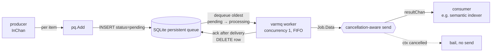

# `queue` — durable channel over a persistent worker queue

The `queue` package turns a plain input channel into a **crash-durable, at-least-once**
stream. Items handed in on one channel are persisted to a SQLite-backed work queue,
processed by a background worker, and delivered on a returned channel — so nothing in
flight is lost across a restart, and a slow consumer never forces the backlog into
memory.

Its concrete use is the handoff from the **semantic backfiller** to the semantic indexer: the
backfiller asks the DB for timeline entries missing a semantic document
(`ListMissingSemanticEventDocumentIDs`) and enqueues each id as a
`TransitionEventReported{TransitionEventId}`; the queue buffers them durably and
`Runtime.TransitionEventIndexerWorker` picks them up. The queue is what lets "an entry needs
indexing" and "the entry is indexed" run at different speeds and survive process death in
between.

> **Note:** the [`timeline`](../components/timeline/README.md) ingest does **not** enqueue.
> An earlier design had the timeline write path push finalized entries onto this queue
> directly via an injected enqueuer; that wiring was removed and is preserved
> commented-out in [`app/app.go`](../app/app.go) so it is trivial to restore. Today the
> backfiller (`semantic/backfiller.go`) is the only producer, kicked off at startup by
> `startStartupSemanticBackfill` and on demand through the backfill coordinator.

## API

The package is a single generic constructor — [`New`](queue.go):

```go
func New[T any](ctx context.Context, opts Options[T]) (<-chan T, error)

type Options[T any] struct {
    Manager sqliteq.Queues // shared SQLite handle (owned by the caller)
    Name    string         // queue table name, e.g. workers.TransitionEventReportedQueueName.String()
    InChan  <-chan T       // producer side: items to enqueue durably
}
```

Note the `.String()`: the constants in [`workers/queue_names.go`](../workers/queue_names.go)
are of type `workers.QueueName`, not `string`.

`New` returns the **consumer** side: range over it to receive each item, exactly as you would
a normal channel, with durability underneath. It spawns one background goroutine (the enqueue
pump) plus a [varmq](https://github.com/goptics/varmq) worker; both are torn down on shutdown.

## Data flow



The two channels never touch directly. The enqueue pump drains `InChan` and writes each item
to the persistent queue (`pq.Add` → a `pending` row); the worker independently pulls the oldest
`pending` row, hands the payload to the delivery callback, and only after the callback returns
does varmq **acknowledge** the job (deleting the row). Work therefore lives in SQLite from
enqueue until successful delivery.

## Delivery & durability semantics

- **At-least-once.** A row is acked (removed) only *after* the delivery callback returns.
  A crash between dequeue and ack leaves the row in `processing`; sqliteq's
  `RequeueNoAckRows` resets those back to `pending` on the next startup, so the item is
  redelivered. **Consumers must be idempotent** — the transition-event indexer keys off
  a stable `TransitionEventId`, which is exactly the property this relies on.
- **FIFO, one at a time.** Dequeue takes the oldest `pending` row and the worker runs at
  concurrency 1, so items are delivered in enqueue order, serially.
- **Backpressure, not memory growth.** The delivery channel is unbuffered, so the worker
  blocks on hand-off until the consumer reads. A slow consumer throttles the whole
  pipeline; the unprocessed backlog stays durably in SQLite rather than piling up in RAM.
- **No retry policy.** Nothing here retries a failed delivery; redelivery exists only through
  the crash-recovery requeue above. Retry semantics belong to the consumer — the indexer worker
  runs its own bounded attempts before giving up on an item.

> **Shutdown caveat (current behaviour):** varmq acks a job the moment its callback
> returns, regardless of whether delivery happened. So a job *in flight at the instant of
> shutdown* is acked without being delivered — lost from this run. Everything still
> `pending` (not yet dequeued) is untouched and survives to the next start. Making the
> in-flight job survive as well means re-enqueueing it in the cancellation branch instead
> of dropping it; that is a deliberate, not-yet-applied change.

## Lifecycle & shutdown

`New` starts work immediately and cleans up on **either** trigger — the caller cancels `ctx`,
or `InChan` closes — funnelling both through one `cleanup`:

```go
cancel()            // unblock any in-flight, cancellation-aware send
stopErr := w.StopAndWait()
close(resultChan)   // signal completion to the consumer
```

`StopAndWait` stops the worker and waits for the **in-flight job only**; it does not drain the
pending backlog, which is the point — those rows stay durable in SQLite and are picked up on
the next start. `New` derives its own cancelable context from the caller's, so an `InChan`
close cancels the delivery callback the same way an external `ctx` cancel does; without that, a
callback blocked on the send during an `InChan`-triggered shutdown would deadlock the stop.
`close(resultChan)` runs strictly *after* the worker has stopped, so no send can race the close.

## Dependencies

| Dependency | Role |
| --- | --- |
| [`varmq`](https://github.com/goptics/varmq) | Worker + persistent-queue binding; job dispatch, delivery callback, ack-after-callback lifecycle |
| [`sqliteq`](https://github.com/goptics/sqliteq) | SQLite-backed queue table (`pending`/`processing`/ack columns), FIFO dequeue, `RequeueNoAckRows` crash recovery |

The `sqliteq.Queues` manager is **injected**, not created here: the caller owns the underlying
`*sql.DB` and is responsible for closing it. Ownership matters — the same handle backs multiple
queue tables, so this package deliberately never closes it. In the sidecar the queue tables live
in the same encrypted SQLite database as the timeline event store (the DSN is reused so the
connection is encrypted identically), keeping durable work co-located with the data it derives
from.

Production wiring constructs exactly one queue, `queue_transition_event_reported`, from
[`app/app.go`](../app/app.go). [`workers/queue_names.go`](../workers/queue_names.go) declares
two further names — `queue_transition_events` and `queue_transition_event_indexed` — but
nothing constructs a queue for either, so no such table exists; they are reserved names,
accepted by `ParseQueueName` and otherwise unused.

## Cross-cutting design themes

- **The store is the buffer.** Items are durable from enqueue to successful delivery; the
  channels are just the producer/consumer ends of a SQLite-backed queue, so restarts
  resume rather than lose work.
- **At-least-once + idempotent consumers.** Redelivery on crash recovery is expected, not
  exceptional; correctness lives in the consumer keying off a stable id.
- **Caller owns the connection.** The DB handle is injected; the queue manages only what
  it creates (worker goroutine, worker pool), and shuts exactly those down.
- **Shutdown is single-pathed.** Every teardown — external cancel or input close — routes
  through one `cleanup` with a fixed cancel → stop → close ordering, so delivery, worker
  stop, and channel close can't race.
