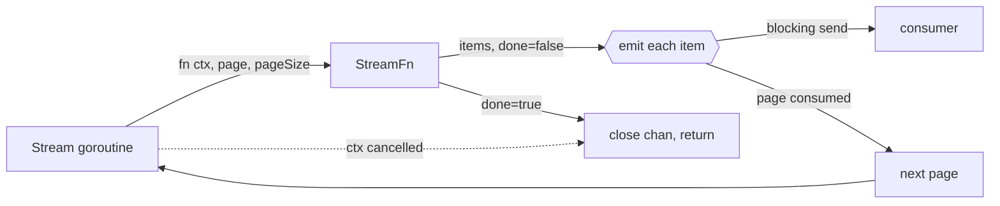

# `utils` — generic helpers shared across the sidecar

The `utils` package is the sidecar's shared vocabulary of small generic helpers: nil/zero
handling, time spans, paged streaming, and a few concurrency combinators. It is **flat and
stateless** — no package-level state, no `init`, nothing that owns a resource or needs
shutting down — and depends on nothing beyond the standard library and
[`negrel/assert`](https://github.com/negrel/assert).

Because it sits underneath everything, its contracts leak into the packages above it. Two
sibling READMEs already lean on helpers documented here: `utils.Stream`'s `done` contract
shapes every read path in [`timeline`](../components/timeline/README.md), and
`utils.ParallelMapWithClone` is what makes concurrent enrichment safe in
[`monitor`](../monitor/README.md). This file is the reference for the helpers themselves;
those READMEs remain the reference for how they are used in anger.

One helper family per file, and the file name is the concept.

## Helper map

| Helper | File | Role |
| --- | --- | --- |
| `Coalesce` | [`coalesce.go`](coalesce.go) | Dereference a pointer, or fall back to a value |
| `ZeroNil` | [`zero_nil.go`](zero_nil.go) | Inverse of `Coalesce` — collapse a zero value to `nil` |
| `IsZero` | [`or.go`](or.go) | Equality against the zero value of `T` |
| `IsEmptyString` | [`or.go`](or.go) | Blank-or-absent test over `string` and `*string` alike |
| `Or` | [`or.go`](or.go) | First item matching a predicate, as a pointer |
| `TimeSpan` | [`time.go`](time.go) | A `[start, end]` pair with containment, overlap and clipping |
| `StreamFn` | [`stream.go`](stream.go) | The paged-fetcher contract |
| `Stream` | [`stream.go`](stream.go) | Drive a `StreamFn` into a back-pressured channel of items |
| `SeqChan` | [`seq_chan.go`](seq_chan.go) | Adapt a receive channel to an `iter.Seq` |
| `ParallelMap` | [`parallel_map.go`](parallel_map.go) | Run N functions concurrently over one input, in declaration order |
| `ParallelMapWithClone` | [`parallel_map.go`](parallel_map.go) | As above, giving each branch its own copy of the input |
| `FanOutChan` | [`fan_out_chan.go`](fan_out_chan.go) | Lossy broadcast of one channel to many |
| `TopN` | [`top_n.go`](top_n.go) | Filter a slice down to its top percentile |

## Nil & zero values (`coalesce.go`, `zero_nil.go`, `or.go`)

```go
func Coalesce[T any](x *T, fallback T) T          // *x, or fallback when x is nil
func ZeroNil[T comparable](v T) *T                // &v, or nil when v is the zero value
func IsZero[T comparable](x T) bool
func IsEmptyString[T string | *string](s T) bool
func Or[T any](predicate func(x T) bool, items ...T) *T
```

These five are the vocabulary behind the sidecar's *nil means absent, zero means empty*
convention. `Coalesce` ([coalesce.go:3-9](coalesce.go#L3-L9)) reads an optional field with a
default; `ZeroNil` ([zero_nil.go:3-9](zero_nil.go#L3-L9)) goes the other way, turning a
value back into an optional one on the way to storage or the wire.

> **Note:** `ZeroNil` is not a strict inverse of `Coalesce`. It cannot distinguish "absent"
> from "legitimately zero" — both become `nil`. That collapse is deliberate and load-bearing:
> it is how the timeline maps an idle observation's `application_id`/`pid` back to `NULL`
> columns (see [Ingest](../components/timeline/README.md#ingest-subscribe_reportergo-upsert_foreground_processgo)).

`IsEmptyString` ([or.go:15-25](or.go#L15-L25)) accepts either a `string` or a `*string` and
answers one question for both: is there any non-whitespace content here? A `nil` pointer, an
empty string and `"   "` are all **empty** — it trims before testing, so blank-but-present
input never counts as content.

`Or` ([or.go:5-13](or.go#L5-L13)) returns the first item satisfying `predicate`, or `nil` if
none do. It returns a **pointer to a copy** of the matched item, not into the argument slice,
so mutating through it does not write back to the caller's data.

## Time spans (`time.go`)

```go
type TimeSpan [2]time.Time                                    // [start, end]

func (s TimeSpan) Between(r TimeSpan) bool                    // s fully inside r, bounds inclusive
func (s TimeSpan) Overlaps(r TimeSpan) bool                   // s intersects r, strict
func (s TimeSpan) Clip(r TimeSpan) (TimeSpan, bool)           // s narrowed to r
func (s TimeSpan) Duration() time.Duration
func (s TimeSpan) ClippedDuration(r TimeSpan) time.Duration
```

`TimeSpan` is an **array, not a slice** — assigning or passing one copies it, so `Clip`
narrows its own copy and can never alias the caller's span.

> **Note the bound asymmetry.** `Between` ([time.go:7-9](time.go#L7-L9)) is inclusive on both
> ends, while `Overlaps` ([time.go:13-15](time.go#L13-L15)) is half-open and strict. A span
> that merely touches a bound is `Between` its container but does **not** `Overlap` it, and a
> zero-length span is `Between` itself while overlapping nothing at all. Pick by intent:
> `Between` for containment, `Overlaps` for intersection.

`Clip` ([time.go:18-31](time.go#L18-L31)) narrows `s` to the part of it falling inside `r`,
reporting `false` when nothing does — an empty or inverted result yields the zero `TimeSpan`,
never a negative one. `Duration` ([time.go:33-39](time.go#L33-L39)) applies the same clamp:
an inverted span is `0`, not a negative duration. `ClippedDuration`
([time.go:42-49](time.go#L42-L49)) is the composition of the two, and is the one you want for
"how much of this span landed in that window".

## Paged streaming (`stream.go`, `seq_chan.go`)

```go
type StreamFn[T any] = func(ctx context.Context, page int, pageSize int) ([]T, bool)

func Stream[T any](ctx context.Context, pageSize int, fn StreamFn[T]) <-chan T
func SeqChan[T any](ch <-chan T) iter.Seq[T]
```

`StreamFn` is a type **alias**, not a defined type, so any function of that shape satisfies it
without conversion — which is why query types across the sidecar can simply declare
`Stream(ctx, svcs) utils.StreamFn[T]` and return a closure.

`Stream` ([stream.go:11-47](stream.go#L11-L47)) turns such a fetcher into a channel of
individual items, pulling one page at a time:



- **`done`, not `ok`.** The second return value stops the stream when `true` — the opposite
  polarity to the `ok` convention used elsewhere in this package. Items handed back
  *alongside* `done == true` are **discarded**, so a terminating fetcher must return its last
  partial page with `done == false` and report exhaustion on the next, empty call. The
  timeline README spells out how its queries satisfy this in
  [Timeline entry streams](../components/timeline/README.md#timeline-entry-streams-get_timelinego-get_timeline_rangego).
- **Unbuffered by design.** The channel has no buffer, so the next page is fetched only once
  the current one has been fully consumed. Paging is driven by the consumer, and a slow reader
  throttles the fetcher rather than filling memory with pages nobody has asked for.
- **Cancellation-aware on both arms.** Both the fetch loop and the per-item send select on
  `ctx.Done()`, and the channel is always closed on return. That means **a short result means
  cancellation, not an empty window** — check `ctx.Err()` after draining.
- `pageSize` must be positive, enforced with `assert.Positive` rather than an error return.
  Like the rest of the sidecar's assertions, it is build-tag gated: active in dev and test,
  compiled out in release.

`SeqChan` ([seq_chan.go:7-15](seq_chan.go#L7-L15)) bridges a channel into a range-over-func
iterator, which is what makes the collect idiom read normally:

```go
entries := slices.Collect(utils.SeqChan(utils.Stream(ctx, pageSize, query.Stream(ctx, svcs))))
if err := ctx.Err(); err != nil {
	// a short slice means cancellation, not an empty window
}
```

It neither closes nor drains the channel it is given — breaking out of the loop (a `yield`
returning `false`) simply abandons the remainder, so cancel the producer's context if you
stop early.

## Parallel fan-in (`parallel_map.go`)

```go
func ParallelMap[T any, U any](
	fns ...func(context.Context, T) (U, bool),
) func(context.Context, T) ([]U, bool)

func ParallelMapWithClone[T any, U any](
	clone func(T) T,
	fns ...func(context.Context, T) (U, bool),
) func(context.Context, T) ([]U, bool)
```

Both build a reusable function that runs **every** `fn` concurrently against the same input
(one `wg.Go` goroutine each) and folds the successes into a slice. `ParallelMap`
([parallel_map.go:15-21](parallel_map.go#L15-L21)) is the thin case: it delegates to
`ParallelMapWithClone` with a no-op clone.

- **Results come back in declaration order.** Each branch tags its result with the index of
  its `fn`, and the collector sorts on that tag before unwrapping — so the concurrency never
  leaks into the output. Callers can rely on position.
- **Failures are dropped, not propagated.** A branch returning `ok == false` contributes
  nothing; the result slice is shorter and the indices of later successes shift down. The
  returned bool is true when **at least one** branch succeeded.
- **No early exit.** The same `ctx` goes to every branch and all of them run to completion,
  even once one has failed. Cancellation is the caller's lever, via that context.
- **`clone` buys isolation.** `ParallelMapWithClone` hands each branch its own copy of the
  input, which is what lets branches write to a value containing a map without racing. This is
  exactly what `enrichment.Merge` relies on to run its enrichers concurrently over an
  `Enrichments` map — see [Enrichment](../monitor/README.md#enrichment-enrichment).

## Channel fan-out (`fan_out_chan.go`)

```go
func FanOutChan[T any](ctx context.Context, inChan <-chan T, outChans ...chan<- T)
```

Spawns a goroutine ([fan_out_chan.go:8-32](fan_out_chan.go#L8-L32)) that copies each item
from `inChan` to every output, returning immediately.

> **Lossy by design.** Sends are non-blocking: an output that is not ready to receive is
> **skipped**, its per-index drop count incremented, and the drop logged via
> `slog.ErrorContext` with the output index and running count. One stalled consumer therefore
> slows nobody down — it just misses items. Buffer the outputs, or drain them promptly, or
> accept the gaps.

It returns when `ctx` is cancelled or `inChan` closes, and **does not close the output
channels**: ownership of those stays with the caller, who may well have other writers.

## Top-N filter (`top_n.go`)

```go
func TopN[T comparable](cmp func(a T, b T) int, percentile float64) func([]T) resultTopN[T]
func (t resultTopN[T]) Distinct() []T
```

`TopN` ([top_n.go:11-49](top_n.go#L11-L49)) returns a reusable filter configured once with a
comparison and a cut-off. Applied to a slice it: dedupes, sorts the distinct values
**descending** by `cmp`, takes the first `ceil(len × percentile/100)` of them, then walks the
**original** slice keeping only members of that set. Order and multiplicity of the input are
preserved — it is a filter, not a ranking.

- **`percentile` is on a 0–100 scale**, not 0–1: pass `10` for the top decile. The cut-off is
  computed over the count of *distinct* values, not the length of the input, and a value
  outside `0..100` slices out of range and panics — it is not clamped.
- The returned type `resultTopN[T]` is **unexported**, so callers bind it with `:=` and cannot
  name it in a signature. Treat it as a `[]T` you can call `Distinct` on.
- `Distinct` ([top_n.go:51-58](top_n.go#L51-L58)) gives the top set with duplicates removed,
  in **map iteration order — which is not deterministic**. Sort it yourself if the order is
  going to be shown to anyone or compared in a test.

## Cross-cutting design themes

- **Generic, stateless, dependency-light.** The standard library plus `negrel/assert`, and not
  one thing in the package owns a resource, keeps state between calls, or needs shutting down.
  Anything that grows a lifecycle has outgrown `utils`.
- **Pointers express absence.** `Coalesce`, `ZeroNil` and `Or` are the shared vocabulary for
  "nil means absent, zero means empty" — the convention the persisted domain types are built
  on, kept in one place rather than re-derived at each boundary.
- **Backpressure over buffering.** `Stream`'s channel is deliberately unbuffered so the
  consumer's pace drives the fetcher. The same instinct as [`queue`](../queue/README.md)
  keeping its backlog in SQLite: hold work where it is cheap, not in RAM.
- **Assertions for programmer error, returns for runtime error.** A non-positive `pageSize` is
  a bug at the call site, so it trips a build-tag-gated assertion instead of being threaded
  back as an error nobody can act on.
- **Deterministic output from concurrent work.** `ParallelMap*` re-sorts into declaration
  order before returning, so callers get parallelism without inheriting its nondeterminism.
- **Lossiness is stated, never silent.** Where a helper drops data — `FanOutChan`'s skipped
  sends, `Stream`'s discarded final page — it is a documented contract, and in `FanOutChan`'s
  case a logged one.
