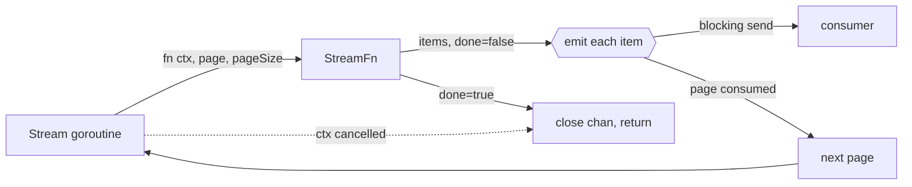
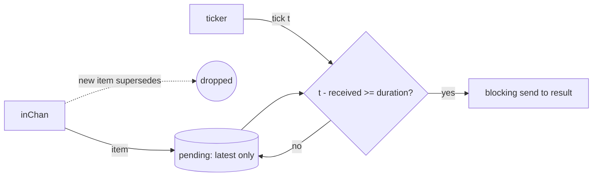

# `utils` — generic helpers shared across the sidecar

The `utils` package is the sidecar's shared vocabulary of small generic helpers: nil/zero
handling, time spans, paged streaming, and a few concurrency combinators. It is **flat and
stateless** — no package-level state, no `init`, nothing that owns a resource or needs
shutting down — and depends on nothing beyond the standard library and
[`negrel/assert`](https://github.com/negrel/assert).

Because it sits underneath everything, its contracts leak into the packages above it.
`Stream`'s `done` contract shapes every read path in
[`timeline`](../components/timeline/README.md), and `ParallelMapWithClone` is what lets
[`monitor`](../monitor/README.md) run its enrichers concurrently. This file is the reference for
the helpers themselves; those READMEs remain the reference for how they are used in anger.

One helper family per file, and the file name is the concept.

## Helper map

| Helper | File | Role |
| --- | --- | --- |
| `Coalesce` | [`coalesce.go`](coalesce.go) | Dereference a pointer, or fall back to a value |
| `ZeroNil` | [`zero_nil.go`](zero_nil.go) | Inverse of `Coalesce` — collapse a zero value to `nil` |
| `IsZero` | [`or.go`](or.go) | Equality against the zero value of `T` |
| `IsEmptyString` | [`or.go`](or.go) | Blank-or-absent test over `string` and `*string` alike |
| `Or` | [`or.go`](or.go) | First item matching a predicate, as a pointer |
| `TimeSpan` | [`time.go`](time.go) | A `[start, end]` pair with containment, overlap and clipping |
| `StreamFn` | [`stream.go`](stream.go) | The paged-fetcher contract |
| `Stream` | [`stream.go`](stream.go) | Drive a `StreamFn` into a back-pressured channel of items |
| `SeqChan` | [`seq_chan.go`](seq_chan.go) | Adapt a receive channel to an `iter.Seq` |
| `ParallelMapWithClone` | [`parallel_map.go`](parallel_map.go) | Run N functions concurrently over one input, each on its own copy |
| `TopN` | [`top_n.go`](top_n.go) | Filter a slice down to its top percentile |
| `ParallelMap` | [`parallel_map.go`](parallel_map.go) | `ParallelMapWithClone` with a no-op clone |
| `FanOutChan` | [`fan_out_chan.go`](fan_out_chan.go) | Lossy broadcast of one channel to many |
| `DurationChan` | [`duration_chan.go`](duration_chan.go) | Trailing debounce — emit an item only once it has survived `duration` unsuperseded |
| `resultTopN.Distinct` | [`top_n.go`](top_n.go) | The top set with duplicates removed |

The three marked *no call sites* compile and are exercised by nothing — treat them as
unverified rather than merely spare.

## Nil & zero values (`coalesce.go`, `zero_nil.go`, `or.go`)

```go
func Coalesce[T any](x *T, fallback T) T          // *x, or fallback when x is nil
func ZeroNil[T comparable](v T) *T                // &v, or nil when v is the zero value
func IsZero[T comparable](x T) bool
func IsEmptyString[T string | *string](s T) bool
func Or[T any](predicate func(x T) bool, items ...T) *T
```

These five are the vocabulary behind the sidecar's *nil means absent, zero means empty*
convention. `Coalesce` reads an optional field with a default; `ZeroNil` goes the other way,
turning a value back into an optional one on the way to storage or the wire. `IsEmptyString`
accepts a `string` or a `*string` and answers one question for both — a `nil` pointer, an empty
string and `"   "` are all **empty**, since it trims before testing. `Or` returns a **pointer to
a copy** of the matched item, not into the argument slice.

> **Note:** `ZeroNil` is not a strict inverse of `Coalesce`. It cannot distinguish "absent"
> from "legitimately zero" — both become `nil`. That collapse is deliberate and load-bearing:
> it is how the timeline maps an idle observation's `application_id`/`pid` back to `NULL`
> columns.

## Time spans (`time.go`)

```go
type TimeSpan [2]time.Time                                    // [start, end]

func (s TimeSpan) Between(r TimeSpan) bool                    // s fully inside r, bounds inclusive
func (s TimeSpan) Overlaps(r TimeSpan) bool                   // s intersects r, strict
func (s TimeSpan) Clip(r TimeSpan) (TimeSpan, bool)           // s narrowed to r
func (s TimeSpan) Duration() time.Duration
func (s TimeSpan) ClippedDuration(r TimeSpan) time.Duration
```

`TimeSpan` is an **array, not a slice** — assigning or passing one copies it, so `Clip` narrows
its own copy and can never alias the caller's span. `Clip` reports `false` when nothing falls
inside, and both it and `Duration` clamp an empty or inverted result to zero rather than
returning a negative one. `ClippedDuration` composes the two, and is the one you want for "how
much of this span landed in that window".

> **Note the bound asymmetry.** `Between` is inclusive on both ends, while `Overlaps` is
> half-open and strict. A span that merely touches a bound is `Between` its container but does
> **not** `Overlap` it, and a zero-length span is `Between` itself while overlapping nothing at
> all. Pick by intent: `Between` for containment, `Overlaps` for intersection.

## Paged streaming (`stream.go`, `seq_chan.go`)

```go
type StreamFn[T any] = func(ctx context.Context, page int, pageSize int) ([]T, bool)

func Stream[T any](ctx context.Context, pageSize int, fn StreamFn[T]) <-chan T
func SeqChan[T any](ch <-chan T) iter.Seq[T]
```

`StreamFn` is a type **alias**, not a defined type, so any function of that shape satisfies it
without conversion — which is why query types across the sidecar can simply declare
`Stream(ctx, svcs) utils.StreamFn[T]` and return a closure. `Stream` drives such a fetcher into
a channel of individual items, one page at a time:



- **`done`, not `ok`.** The second return value stops the stream when `true` — the opposite
  polarity to the `ok` convention used elsewhere in this package. Items handed back
  *alongside* `done == true` are **discarded**, so a terminating fetcher must return its last
  partial page with `done == false` and report exhaustion on the next, empty call.
- **Unbuffered by design.** The next page is fetched only once the current one has been fully
  consumed, so paging is driven by the consumer and a slow reader throttles the fetcher rather
  than filling memory with pages nobody asked for.
- **A short result means cancellation, not an empty window.** Both the fetch loop and the
  per-item send select on `ctx.Done()`, and the channel is always closed on return — so check
  `ctx.Err()` after draining.

`SeqChan` bridges a channel into a range-over-func iterator, which is what makes the collect
idiom read normally:

```go
entries := slices.Collect(utils.SeqChan(utils.Stream(ctx, pageSize, query.Stream(ctx, svcs))))
if err := ctx.Err(); err != nil {
	// a short slice means cancellation, not an empty window
}
```

It neither closes nor drains the channel it is given — breaking out of the loop simply abandons
the remainder, so cancel the producer's context if you stop early.

## Concurrency combinators (`parallel_map.go`, `fan_out_chan.go`, `duration_chan.go`)

```go
func ParallelMapWithClone[T any, U any](
	clone func(T) T,
	fns ...func(context.Context, T) (U, bool),
) func(context.Context, T) ([]U, bool)

func FanOutChan[T any](ctx context.Context, inChan <-chan T, outChans ...chan<- T)

func DurationChan[T any](
	ctx context.Context,
	ticker <-chan time.Time,
	duration time.Duration,
	inChan <-chan T,
) <-chan T
```

`ParallelMapWithClone` builds a reusable function that runs **every** `fn` concurrently against
the same input and folds the successes into a slice, tagged by index and re-sorted so results
come back in declaration order. Failures are dropped rather than propagated — the returned bool
is true when *at least one* branch succeeded — and there is no early exit, so cancellation is
the caller's lever via the shared `ctx`. `clone` buys isolation: it hands each branch its own
copy of the input, which is what lets `enrichment.Merge` run enrichers concurrently over a value
containing a map — see [Enrichment](../monitor/README.md#enrichment-enrichment).

> **`FanOutChan` is lossy by design.** Sends are non-blocking: an output not ready to receive is
> **skipped**, its per-index drop count incremented, and the drop logged via `slog.ErrorContext`.
> One stalled consumer therefore slows nobody down — it just misses items. It returns when `ctx`
> is cancelled or `inChan` closes, and does **not** close the output channels; ownership of those
> stays with the caller.

`DurationChan` is a **trailing-edge debounce**: it holds at most one item and forwards it only
once `duration` has passed without a replacement arriving. Anything superseded inside that window
never reaches the output. It exists for the usage timeline, which draws sessions at one-minute
granularity next to a live *Now* marker — a sub-minute session still claims a full minute of block
height, with *Now* sitting inside it, and it cannot simply be removed because it is a now-it's-here
now-it's-not affair. Debouncing the feed means such a session is never published in the first place.



- **The ticker is the clock, and the caller owns it.** Nothing is ever emitted between ticks, so
  the real hold time is `duration` rounded up to the next tick; a ticker that never fires means an
  output that never produces. `DurationChan` neither creates nor stops it.
- **Age is measured against the tick's own timestamp**, not the moment the tick was received —
  `t.Sub(received)`, where `received` is `time.Now()` at arrival. Real `time.Ticker` values behave;
  a hand-fed channel in a test must send plausible times or the comparison is meaningless.
- **One slot, latest wins.** Memory is flat no matter how fast the producer runs, and the output
  send is **blocking** — a slow consumer stalls the loop rather than growing a backlog, but no
  item is dropped for slowness alone, only for being superseded.
- **Draining close.** When `inChan` closes it is set to `nil` so the closed case stops spinning in
  the `select`; a still-pending item is then flushed on the tick where it comes of age, and the
  goroutine returns on that same tick. Termination therefore needs **at least one tick after the
  close** — an idle ticker leaves it alive until `ctx` is cancelled. The output channel is always
  closed on return.

> **No call sites yet.** `DurationChan` compiles and is exercised by nothing — treat its contract
> as unverified rather than merely spare.

## Top-N filter (`top_n.go`)

```go
func TopN[T comparable](cmp func(a T, b T) int, percentile float64) func([]T) resultTopN[T]
func (t resultTopN[T]) Distinct() []T
```

`TopN` returns a reusable filter configured once with a comparison and a cut-off. Applied to a
slice it dedupes, sorts the distinct values **descending** by `cmp`, takes the first
`ceil(len × percentile/100)` of them, then walks the **original** slice keeping only members of
that set. Order and multiplicity of the input are preserved — it is a filter, not a ranking.

- **`percentile` is on a 0–100 scale**, not 0–1: pass `10` for the top decile. The cut-off is
  computed over the count of *distinct* values, and a value outside `0..100` slices out of range
  and **panics** — it is not clamped.
- The returned type `resultTopN[T]` is **unexported**, so callers bind it with `:=` and cannot
  name it in a signature. Treat it as a `[]T` you can call `Distinct` on.
- `Distinct` gives the top set with duplicates removed, in **map iteration order — which is not
  deterministic**. Sort it yourself if the order is going to be shown to anyone or compared in a
  test.

## Cross-cutting design themes

- **Generic, stateless, dependency-light.** The standard library plus `negrel/assert`, and not
  one thing in the package owns a resource, keeps state between calls, or needs shutting down.
  Anything that grows a lifecycle has outgrown `utils`.
- **Pointers express absence.** `Coalesce`, `ZeroNil` and `Or` are the shared vocabulary for
  "nil means absent, zero means empty" — the convention the persisted domain types are built
  on, kept in one place rather than re-derived at each boundary.
- **Backpressure over buffering.** `Stream`'s channel is deliberately unbuffered so the
  consumer's pace drives the fetcher. The same instinct as [`queue`](../queue/README.md)
  keeping its backlog in SQLite: hold work where it is cheap, not in RAM.
- **Deterministic output from concurrent work.** `ParallelMap*` re-sorts into declaration
  order before returning, so callers get parallelism without inheriting its nondeterminism.
- **Lossiness is stated, never silent.** Where a helper drops data — `FanOutChan`'s skipped
  sends, `Stream`'s discarded final page, `DurationChan`'s superseded items — it is a documented
  contract, and in `FanOutChan`'s case a logged one.
- **The clock is injected, never taken.** `DurationChan` receives a tick channel rather than
  starting a `time.Ticker` of its own, keeping the package free of anything with a lifecycle to
  shut down — and leaving the caller free to drive it from a fake clock.
